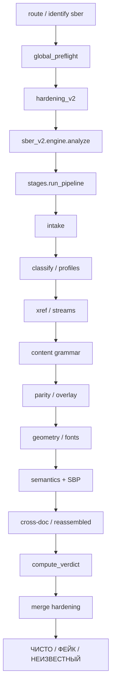

# СБЕРБАНК — VALIDATOR SPECIFICATION v2.1
## Как сейчас работает валидатор PDF-квитанций СберБанка (фактическая реализация)

**Дата фиксации:** 21.07.2026  
**Статус:** Production (без shadow / без процентного rollout на live-пути)  
**Проект:** `pdf-checker-bot`  
**Движок:** `sber_v2` / `VALIDATOR_VERSION = "2.1.0"`  
**Сервер:** `85.192.40.122`, сервис `pdfbot`, бот `@proton_pdf_bot`  
**Источник истины:** код в `detector/sber_v2/` + `detector/sber_*.py`  
**Зонтичный документ:** `PDFCHECKER_VALIDATOR_SPEC_v1*.md`  
**Аналоги:** `TBANK_VALIDATOR_SPEC_v6.md`, `ALFA_VALIDATOR_SPEC_v2.md`

---

## 0. Назначение

Этот документ описывает **только СберБанк**: роутинг, pipeline, каталоги HARD/KNOWN/B/IGNORE, профили квитанций, SBP-cipher, шрифты, контейнер, bot UX, атлас, деплой — **как реально работает код на 20.07.2026**.

| Термин | Значение |
|--------|----------|
| `sber_v2` | Единственный **live** decision engine Сбера |
| `sber_v1` | Код есть (`1.0.0-future-safe`), **не** на live-входе `detector/sber.py` |
| `sber_legacy` | Старый score-engine — только через dormant v1 rollout |
| HARD | Один флаг → **ФЕЙК** |
| KNOWN | Подтверждённая сигнатура → **ФЕЙК** |
| Supporting (tier B) | ФЕЙК только при **≥2 разных группах** |
| IGNORE / DIAGNOSTIC | Не влияют на вердикт |
| `НЕИЗВЕСТНЫЙ ДОКУМЕНТ` | Целостный неизвестный профиль без внутренних противоречий |
| Novelty | Новый FontFile2 SHA / page size / subset ≠ фейк |

**Главный принцип:** новизна ≠ подделка. ФЕЙК только при **межслойном противоречии**, **известной сигнатуре**, или **согласии ≥2 независимых Tier-B групп**. Неизвестный, но внутренне согласованный профиль → `НЕИЗВЕСТНЫЙ ДОКУМЕНТ`, не ФЕЙК.

---

## Содержание

1. [Главный принцип и запреты](#1-главный-принцип-и-запреты)
2. [Точка входа и роутинг](#2-точка-входа-и-роутинг)
3. [Карта файлов](#3-карта-файлов)
4. [Выходной словарь и типы](#4-выходной-словарь-и-типы)
5. [Вердикт (ЧИСТО / ФЕЙК / НЕИЗВЕСТНЫЙ)](#5-вердикт-чисто--фейк--неизвестный)
6. [Каталог правил](#6-каталог-правил)
7. [Профили квитанций](#7-профили-квитанций)
8. [Pipeline по стадиям](#8-pipeline-по-стадиям)
9. [Модули-детекторы (детально)](#9-модули-детекторы-детально)
10. [СБП ID: структура и грамматика](#10-сбп-id-структура-и-грамматика)
11. [Legacy document / internal doc](#11-legacy-document--internal-doc)
12. [Шрифты и glyph](#12-шрифты-и-glyph)
13. [Корпусный атлас](#13-корпусный-атлас)
14. [Hardening для Sber](#14-hardening-для-sber)
15. [Telegram-бот](#15-telegram-бот)
16. [Деплой, env, регрессии](#16-деплой-env-регрессии)
17. [Запрещённые ложные признаки](#17-запрещённые-ложные-признаки)
18. [Расхождения с v1 / dormant](#18-расхождения-с-v1--dormant)
19. [Приложения](#19-приложения)

---

## 1. Главный принцип и запреты

| Параметр | Значение |
|----------|----------|
| Внешний вердикт | **ЧИСТО** / **ФЕЙК** / **НЕИЗВЕСТНЫЙ ДОКУМЕНТ** |
| Score | **0** или **60** (`FAKE_THRESHOLD`) |
| Engine | `sber_v2` |
| Rollout на live | нет — `rollout_mode: "full"` захардкожен в `engine.py` |

**Не банить за:**
- неизвестный FontFile2 SHA (`SBER_NEW_FONTFILE2_SHA` → IGNORE)
- новый page size / image bundle / subset prefix
- новый producer observation
- один supporting-флаг без второй группы
- empirical SBP marker/tail alone (Tier-B, нужна вторая группа)
- layout/skeleton drift alone

**Два слоя:**
1. Структурный — xref/object graph, streams, BT/ET grammar, fonts, overlay  
2. Семантический — профильные поля, SBP cipher, сумма/комиссия, dual-parser parity, cross-doc

---

## 2. Точка входа и роутинг

### 2.1. Общий поток

```
PDF bytes
  → detector/__init__.py::route()
       → fitz: text + producer
       → profiles.identify(...)          # key == "sber"?
       → run_global_preflight()          # мгновенный HARD score 95
       → run_hardening_v2(bank_key="sber")
       → profiles.analyze_for("sber")
            → detector/sber.py
                 → sber_v2.engine.analyze()
       → merge_hardening_into_result()
       → has_decisive_evidence → force ФЕЙК score≥95
       → apply_v2_priority()             # никогда не даунгрейдит engine "sber*"
  → (bank_name="Сбербанк", result, is_tbank=False)
```

**Отличие от T-Bank:** для Sber вызывается полный `run_hardening_v2` + merge. Для T-Bank — только global preflight.

### 2.2. Профиль — `profiles.py`

| Поле | Значение |
|------|----------|
| `key` | `"sber"` |
| `name` | `"Сбербанк"` |
| Markers | `чек по операции`, `перевод клиенту сбербанка`, `сбербанк`, `сбер` |
| Producers | `itext 2.1.7` |
| `min_score` | `0.45` |

**Особые бусты / конфликты:**
- Quartz iOS card-transfer → усиление sber  
- Exclusive `itext 2.1.7` (кроме GPB-доменов) → sber  
- GPB domain override может перебить exclusive sber  

### 2.3. Обёртка — `detector/sber.py`

```python
"""СберБанк — v2.0 production validator (tbank_v6-strength, no shadow)."""
from .sber_v2.engine import VALIDATOR_VERSION, analyze
```

Нет `apply_rollout`. Shadow/`SBER_V1_ROLLOUT` на live-пути **не используются**.

### 2.4. Reroute из Газпромбанка

`gazprombank.py` → `_reroute_sber`: при excluded corpus SHA или emitter=`sber` вызывает `sber.analyze`.

---

## 3. Карта файлов

### Decision engine (`sber_v2/`) — LIVE

| Файл | Роль |
|------|------|
| `engine.py` | Entry: SHA-256 → pipeline → verdict → expert_report |
| `stages.py` | Полный pipeline (classify → … → reassembled) |
| `verdict.py` | ЧИСТО / ФЕЙК / НЕИЗВЕСТНЫЙ ДОКУМЕНТ, `ingest_flag` |
| `rules.py` | HARD / KNOWN / SUPPORTING / IGNORE + PROFILE_IDS |
| `types.py` | `SberFlag`, `PipelineResult` |
| `explain.py` | Expert report (verbose / `@kronlead`) |
| `container.py` | xref / object graph / structure |
| `streams.py` | Length/zlib + active content |
| `content.py` | BT/ET grammar + skeleton drift |
| `parity.py` | fitz vs pypdf vs raw content IDs |
| `overlay.py` | hidden / off-page / white text |
| `geometry.py` | required labels + card Y-order |
| `fonts.py` | forensics + FontFile2 vs atlas |
| `semantics.py` | semantic tuples + **live SBP** + legacy doc |
| `sbp.py` | Дубликат SBP-логики — **не** импортируется `stages.py` |
| `profile_gates.py` | точный профиль / atlas gate |
| `atlas.py` | загрузка atlas JSON |
| `atlas_data/sber_atlas_v2.json` | корпусный атлас |
| `cross_document.py` | SQLite identity + reassembled assets |
| `known_signatures.py` | KNOWN sets (сейчас **пустые**) |
| `__init__.py` | re-export `analyze` |

### Shared live-модули

| Модуль | Назначение |
|--------|------------|
| `sber_profiles.py` | classify submethod, extract IDs/dates/amounts, generator path |
| `sber_sbp_cipher.py` | SBP 32-char cipher + legacy 36-char document |

### Dormant / не на decision path v2

| Модуль | Статус |
|--------|--------|
| `sber_v1/*` | Полный v1 pipeline — **не** live entry |
| `sber_legacy.py` | Score-engine — только через v1 rollout |
| `sber_sbp_layout.py` | Layout envelope — `bank_spec_engine` / soft score, не v2 pipeline |
| `bank_specs/sber_sbp_layout.json` | Профиль layout-tool |

---

## 4. Выходной словарь и типы

### 4.1. `engine.analyze()` → dict

```python
{
  "verdict": "ЧИСТО" | "ФЕЙК" | "НЕИЗВЕСТНЫЙ ДОКУМЕНТ",
  "emoji":   "✅" | "🔴" | "⚪",
  "score":   0 | 60,
  "flags":   ["[CODE] detail", ...],   # только decisive
  "details": {
     "file_hash",
     "validator_version": "2.0.0",
     "engine": "sber_v2",
     "rollout_mode": "full",
     "bank_key": "sber",
     "profile_id",              # sbp_outgoing | … | unknown*
     "submethod",               # SBR-P1 … SBR-P6
     "submethod_label",
     "generator_path",          # jasper_itext | pdfium | ios_quartz | unknown_coherent
     "new_coherent_profile": bool,
     "completed_checks": [...],
     "stats": {...},
     "hard_count", "known_fake_count", "supporting_count",
     "ignored_observations": [...],
     "analysis_complete": bool,
     "cross_document_identity_conflict": bool,
     "expert_report": {...},
     "user_message": "Обнаружена подделка."
                     | "Неизвестный целостный профиль документа."
                     | "Признаков подделки не найдено."
  }
}
```

### 4.2. `PipelineResult` / `SberFlag`

Флаги копятся в `hard_flags` / `known_fake_flags` / `supporting_flags` / `ignored_observations`.  
Также: `not_sber_receipt`, `new_coherent_profile`, `cross_document_identity_conflict`, `profile_id`, `submethod`, `generator_path`, `stats`.

---

## 5. Вердикт (ЧИСТО / ФЕЙК / НЕИЗВЕСТНЫЙ)

`sber_v2/verdict.py` — порядок строго такой:

```
1. !analysis_complete                → ФЕЙК [ANALYSIS_NOT_COMPLETED] score 60
2. not_sber_receipt                  → ФЕЙК [NOT_SBER_RECEIPT] score 60
3. known_fake ∪ hard_flags           → ФЕЙК (все decisive lines) score 60
4. cross_document_identity_conflict  → ФЕЙК [SBER_CROSS_DOCUMENT_IDENTITY_CONFLICT] score 60
5. ≥2 distinct supporting groups     → ФЕЙК (все B-flags) score 60
6. new_coherent_profile              → НЕИЗВЕСТНЫЙ ДОКУМЕНТ score 0
7. иначе                             → ЧИСТО score 0 flags=[]
```

`ingest_flag`:
- tier DIAGNOSTIC/IGNORE → `ignored_observations`
- code ∈ KNOWN или tier=KNOWN → `known_fake_flags`
- code ∈ HARD или tier HARD/A → `hard_flags`
- code ∈ SUPPORTING_GROUPS или tier=B → `supporting_flags`
- иначе → `ignored_observations`

Один supporting-флаг **никогда** не даёт ФЕЙК.

**Отличие от T-Bank:** есть третий вердикт `НЕИЗВЕСТНЫЙ ДОКУМЕНТ` для целостного неизвестного профиля.

---

## 6. Каталог правил

Источник: `detector/sber_v2/rules.py`.

### 6.1. HARD (один → ФЕЙК)

**Intake / identity:**  
`ANALYSIS_NOT_COMPLETED`, `NOT_SBER_RECEIPT`

**Container / object graph:**  
`SBER_XREF_OBJECT_GRAPH_CONFLICT`, `PDF_STRUCTURE_INVALID`, `MULTIPLE_PDF_HEADERS`, `TRAILER_INVALID`, `XREF_OFFSET_INVALID`, `DUPLICATE_ACTIVE_OBJECT_DEFINITION`, `BROKEN_OBJECT_STRUCTURE`, `OBJECT_GRAPH_INCONSISTENT`, `TRAILING_DATA_AFTER_EOF`, `MULTIPLE_STARTXREF_PRESENT`

**Streams:**  
`SBER_STREAM_INTEGRITY_VIOLATION`, `STREAM_DECOMPRESSION_FAILED`, `STREAM_LENGTH_MISMATCH`, `UNEXPECTED_STREAM_FILTER`

**Active content:**  
`JAVASCRIPT_PRESENT`, `ACTIVE_CONTENT_PRESENT`, `OPENACTION_PRESENT`, `DANGEROUS_ACTION_PRESENT`, `EMBEDDED_FILE_PRESENT`, `EMBEDDED_PAYLOAD_PRESENT`, `ACROFORM_PRESENT`, `XFA_PRESENT`

**Content / visibility:**  
`SBER_CONTENT_OPERATOR_GRAMMAR_CONFLICT`, `SBER_BT_ET_MISMATCH`, `SBER_DUAL_PARSER_FIELD_PARITY`, `SBER_OVERLAY_HIDDEN_TEXT_LAYER`, `SBER_LABEL_VALUE_GEOMETRY_CONFLICT`, `TEXT_LAYER_INCONSISTENT`, `BROKEN_CYRILLIC_MAPPING`, `TEXT_EXTRACTION_MAPPING_ANOMALY`, `RECEIPT_TEXT_LAYER_MISSING`

**Fonts:**  
`SBER_FONT_LAYER_CONTAMINATION`, `USED_CID_MISSING_FROM_CMAP`, `USED_CID_MISSING_FROM_W`, `CMAP_W_MISMATCH`, `CMAP_INVALID`, `FONTFILE2_MISSING`, `MISSING_FONT_OBJECT`, `USED_CID_EMPTY_GLYPH`, `GLYPH_SLOT_TRANSPLANT`, `GLYPH_OUTLINE_MISMATCH`, `SBER_FONT_CID_CLOSURE_VIOLATION`

**Semantics / SBP:**  
`SBER_LINKED_SEMANTIC_TUPLE_CONFLICT`, `SBER_REQUIRED_FIELD_MISSING`, `SBER_SBP_LINKED_TUPLE_CONFLICT`, `SBER_SBP_TIMESTAMP_MISMATCH`, `SBER_AMOUNT_ARITHMETIC_MISMATCH`, `FIELD_FORMAT_INVALID`, `AMOUNT_MISMATCH_BETWEEN_TOTAL_AND_DETAILS`

**Cross-document:**  
`SBER_CROSS_DOCUMENT_IDENTITY_CONFLICT`, `OPERATION_ID_REUSED`

### 6.2. KNOWN

| Code | Смысл |
|------|--------|
| `SBER_KNOWN_FAKE_SIGNATURE` | точная known-fake сигнатура |
| `SBER_REASSEMBLED_BANK_ASSETS` | пересобранные банковские assets |

На 20.07.2026 множества в `known_signatures.py` **пустые** — KNOWN-путь инертен, пока не наполнят корпус.

### 6.3. Supporting (tier B) — группы

| Группа | Коды |
|--------|------|
| `B2_layout_content` | `SBER_CONTENT_SKELETON_DRIFT`, `SBER_LAYOUT_DRIFT` |
| `B1_serializer_container` | `STREAM_COMPRESSION_RATIO_OUTLIER`, `DECODED_STREAM_SIZE_OUTLIER`, `STREAM_FILTER_ANOMALY`, `SBER_SERIALIZER_PROFILE_SHIFT` |
| `B3_metadata_profile` | `SBER_METADATA_PROFILE_SHIFT`, `PDF_MODDATE_EDITED` |
| `B4_static_assets` | `SBER_STATIC_ASSET_PROFILE_SHIFT` |
| `B4_font_subsetter` | `SBER_FONT_SUBSETTER_PROFILE_SHIFT` |
| `B5_sbp_empirical` | `SBER_SBP_EMPIRICAL_PROFILE`, `SBER_SBP_TAIL_UNKNOWN`, `SBER_SBP_MARKER_UNKNOWN` |
| `B6_cross_document_weak` | `SBER_CROSS_DOCUMENT_WEAK_MATCH` |

### 6.4. IGNORE

`SBER_NEW_PRODUCER_OBSERVATION`, `SBER_NEW_FONTFILE2_SHA`, `SBER_NEW_PAGE_SIZE`, `SBER_NEW_IMAGE_BUNDLE`, `SBER_NEW_SUBSET_PREFIX`,  
`MULTIPLE_EOF_PRESENT`, `MULTIPLE_XREF_PRESENT`, `PREV_TRAILER_PRESENT`, `INCREMENTAL_UPDATE_PRESENT`

---

## 7. Профили квитанций

### 7.1. Live profile_id

| `profile_id` | Legacy | Label |
|--------------|--------|-------|
| `card_other_ios` | SBR-P1 | Перевод в другой банк по номеру карты |
| `sber_internal_jasper` | SBR-P2 | Перевод клиенту СберБанка |
| `sber_internal_pdfium` | SBR-P3 | Перевод клиенту СберБанка (PDFium) |
| `legacy_phone` | SBR-P4 | Перевод по номеру телефона (legacy) |
| `sbp_outgoing` | SBR-P5 | Перевод по СБП |
| `sbp_request` | SBR-P6 | Перевод по запросу СБП |

### 7.2. Generator paths (`sber_profiles.detect_generator_path`)

| Path | Маркеры Producer/Creator |
|------|--------------------------|
| `ios_quartz` | `quartz pdfcontext` |
| `pdfium` | `pdfium` |
| `jasper_itext` | `jasperreports` / `itext` |
| `unknown_coherent` | всё остальное |

Неизвестный, но согласованный генератор + отсутствие mapped profile → `new_coherent_profile=True` → вердикт **НЕИЗВЕСТНЫЙ ДОКУМЕНТ** (если нет HARD).

### 7.3. Required labels (geometry)

| Профиль | Обязательные метки (нижний регистр) |
|---------|-------------------------------------|
| `sbp_outgoing` | сумма, получатель, номер операции в сбп |
| `sbp_request` | сумма, номер операции в сбп |
| `sber_internal_jasper` / `pdfium` | сумма, получатель |
| `legacy_phone` | сумма, телефон |
| `card_other_ios` | сколько, комиссия, списано |

Foreign template markers (`квитанция тинькофф`, `alfa-bank receipt`, crypto …) → HARD `SBER_LABEL_VALUE_GEOMETRY_CONFLICT`.

Для `card_other_ios`: Y-порядок **Сколько ≤ Комиссия ≤ Списано**.

---

## 8. Pipeline по стадиям

`sber_v2/stages.py` → `run_pipeline`:

| # | `completed_checks` | Что делает |
|---|--------------------|------------|
| 1 | `intake` | пустой / encrypted / size > **8_000_000** → incomplete |
| 2 | `classify`, `is_sber_receipt` | generator; `is_sber_receipt`; `classify_submethod` → `LEGACY_TO_PROFILE`; new coherent gate |
| 3 | `xref_object_graph` | container / xref integrity |
| 4 | `stream_integrity` | Length↔body, zlib, soft compression outliers, **active content** |
| 5 | `content_grammar` | BT/ET, padding `%` comments, skeleton vs atlas |
| 6 | `dual_parser_parity` | fitz / pypdf / raw: SBP / legacy / internal IDs |
| 7 | `overlay_hidden_text` | off-page / zero-size / white digit overlays (**≥3** → HARD) |
| 8 | `label_value_geometry` | foreign markers; required labels; card Y-order |
| 9 | `font_contamination` | pdf_forensics + FontFile2 atlas |
| 10 | *(semantics)* | `check_semantic_tuples` |
| 11 | *(sbp)* | `semantics.check_sbp_linked_tuple` (**не** `sbp.py`) |
| 12 | `semantic_sbp` | `check_legacy_document` (только `legacy_phone`) |
| 13 | `cross_document_identity` | SQLite sightings |
| 14 | `reassembled_assets` | known sigs / deferred asset mix |
| 15 | `pipeline_complete` | |

Early exit после classify, если `not_sber_receipt`.

---

## 9. Модули-детекторы (детально)

### 9.1. Container (`container.py`)

Физический xref/object graph, duplicate active objects, trailing after EOF, multiple startxref → HARD.  
Incremental/multiple EOF/xref/Prev — в IGNORE (не вердикт сами по себе).

### 9.2. Streams (`streams.py`)

- Length vs raw body, zlib decompress failures → HARD  
- Compression ratio / decoded size outliers → Tier-B `B1_serializer_container`  
- JS / OpenAction / Embed / AcroForm / XFA внутри streams-прохода → HARD active-content коды

### 9.3. Content grammar (`content.py`)

- BT≠ET, operator grammar, padding comments → HARD  
- Unknown content skeleton vs atlas → `SBER_CONTENT_SKELETON_DRIFT` (B2)

### 9.4. Dual-parser parity (`parity.py`)

Сравнение извлечённых `sbp_id` / `legacy_doc` / `internal_doc` из fitz, pypdf и raw content stream. Расхождение → `SBER_DUAL_PARSER_FIELD_PARITY` HARD.

### 9.5. Overlay (`overlay.py`)

Скрытый / заэкранный / белый текст. При **≥3** hidden spans → `SBER_OVERLAY_HIDDEN_TEXT_LAYER` HARD.

### 9.6. Geometry (`geometry.py`)

См. §7.3. Missing required labels на точном профиле → обычно skeleton/layout Tier-B (через gate), foreign template → HARD.

### 9.7. Semantics (`semantics.py`)

- Linked semantic tuples (controls / corrupt glyphs / «сейчас») → `SBER_LINKED_SEMANTIC_TUPLE_CONFLICT`  
- Card arithmetic: **Списано = Сколько + Комиссия** (±0.02 ₽) → `SBER_AMOUNT_ARITHMETIC_MISMATCH`  
- Dual-parser miss + exact profile → `SBER_REQUIRED_FIELD_MISSING`  
- SBP: см. §10  
- Legacy phone doc: см. §11

### 9.8. Cross-document (`cross_document.py`)

SQLite path: env `SBER_V2_IDENTITY_DB` (default temp `sber_v2_identity.db`).  
Тот же SBP/doc/trailer + другие amount/receiver/date/mask/ast → HARD conflict.  
Совпадение слабых полей → `SBER_CROSS_DOCUMENT_WEAK_MATCH` (B6).

### 9.9. Reassembled / known (`cross_document` + `known_signatures`)

`SBER_REASSEMBLED_BANK_ASSETS` / `SBER_KNOWN_FAKE_SIGNATURE` — KNOWN, пока sets пустые → не стреляют.

### 9.10. Profile gates (`profile_gates.py`)

HARD field/geometry требуют `profile_id ∈ PROFILE_IDS` **и** наличие профиля в atlas. Иначе правила смягчаются / пропускаются.

---

## 10. СБП ID: структура и грамматика

### 10.1. Источник истины — `sber_sbp_cipher.py`

Regex: `^[AB][0-9A-Z]{31}$` — **ровно 32 символа**.

| Индексы | Поле | Смысл |
|---------|------|-------|
| `[0]` | marker | `A` или `B` |
| `[1:5]` | core block | `enc_doy = int(...) % 1000`; year digit = thousands place |
| `[5:7]` | UTC hour | 00–23 |
| `[7:9]` | UTC minute | 00–59 |
| `[9:11]` | UTC second | 00–59 |
| `[11:32]` | tail | 21-символьный alnum хвост |

**Важно:** это **не** T-Bank разбор (`route_marker` / `control` / `class` / `bank5`). У Сбера другая модель core+tail.

### 10.2. Timestamp contract

1. Из чека парсится дата/время операции (`sber_profiles.parse_operation_datetime`) — словоформа «N месяца YYYY HH:MM[:SS]».  
2. Сравнение: `op_utc = receipt_dt − 3h` (MSK→UTC) vs encoded UTC из ID.  
3. `|Δdoy| > 2` → HARD timestamp.  
4. Cipher HARD при `|Δt| > 90s` (`_SBER_TS_HARD_SEC`).  
5. Soft observation при Δt вне `[0, 15]` сек.  
6. **Live v2 promote:** в `semantics.check_sbp_linked_tuple` при `|Δt| > 15s` → HARD  
   `SBER_SBP_TIMESTAMP_MISMATCH` + `SBER_SBP_LINKED_TUPLE_CONFLICT`.

Корпусное наблюдение: core обычно **на 3–10 секунд раньше** видимого времени операции (не T-Bank допуск 0–1s).

### 10.3. Mapping cipher → live HARD codes

| Cipher code | Live HARD |
|-------------|-----------|
| `SBER_SBP_ID_MISSING` | `SBER_SBP_LINKED_TUPLE_CONFLICT` |
| `SBER_SBP_ID_STRUCTURE` | `SBER_SBP_LINKED_TUPLE_CONFLICT` |
| `SBER_SBP_ID_TIMESTAMP` | `SBER_SBP_TIMESTAMP_MISMATCH` (+ linked conflict) |

### 10.4. Empirical Tier-B (atlas)

Для `sbp_outgoing` / `sbp_request`:
- marker `opid[0]` ∉ atlas markers → `SBER_SBP_MARKER_UNKNOWN` (B5)  
- tail prefix4 `opid[11:15]` ∉ atlas → `SBER_SBP_EMPIRICAL_PROFILE` (B5)

Один B5-флаг **не** делает ФЕЙК.

### 10.5. Когда SBP проверяется

Только при `profile_id ∈ {sbp_outgoing, sbp_request}`. Иначе stage skip.

### 10.6. Orphan: `sber_v2/sbp.py`

Файл существует и дублирует логику, но **pipeline вызывает только** `semantics.check_sbp_linked_tuple`. При правках SBP править `semantics.py` + `sber_sbp_cipher.py`.

---

## 11. Legacy document / internal doc

### 11.1. Legacy phone document (36 chars)

Формат: `YYYYMMDDHHMMSS` (14) + `[a-z0-9]{22}` tail.  
Проверка: `validate_legacy_document` при `profile_id == legacy_phone`.  
Допуск Δt: **[-5, 60] секунд** относительно операции. Вне окна → флаги timestamp (через cipher result).

### 11.2. Internal document

Regex: `^100\d{16}$` (19 цифр). Извлекается для parity; отдельного cipher-HARD в v2 semantics нет.

---

## 12. Шрифты и glyph

`fonts.py`:
1. `run_pdf_forensics(bank="sber", tier="jasper")`  
2. HIGH + font-hard set → HARD + обёртка `SBER_FONT_LAYER_CONTAMINATION`  
3. Jasper soft W-array anomalies → DIAGNOSTIC  
4. Unknown FontFile2 sha16 vs atlas → `SBER_NEW_FONTFILE2_SHA` (**IGNORE**, никогда solo HARD)

CID/CMap/W/FontFile2/empty glyph/slot transplant/outline — те же HARD-коды, что в §6.1.

---

## 13. Корпусный атлас

| Параметр | Значение |
|----------|----------|
| Path | `detector/sber_v2/atlas_data/sber_atlas_v2.json` |
| Schema | `sber-v2-atlas` / version `1.0.0` |
| Corpus root (сборка) | `…/чеки/сбер` |
| PDF count | **22** |
| Builder | `tools/build_sber_atlas_v2.py` |

**Profile counts в атласе:**

| Профиль | N |
|---------|---|
| `sbp_outgoing` | 13 |
| `sber_internal_jasper` | 5 |
| `sbp_request` | 1 |
| `card_other_ios` | 1 |
| `sber_internal_pdfium` | 1 |
| `legacy_phone` | 1 |

На профиль хранятся: producers, content_skeletons, page_sizes, fontfile2_sha16, image_sha16, sbp_markers, sbp_tail_prefix4, stream histograms.

**Заметки атласа (принцип):** static hashes — diagnostic-only; unknown coherent → НЕИЗВЕСТНЫЙ; pdfium — легитимный путь.

Layout-JSON `detector/bank_specs/sber_sbp_layout.json` — **не** часть v2 decision path.

---

## 14. Hardening для Sber

В `route()` для non-TBank (включая sber):

1. `run_global_preflight` — early hard-fake  
2. `run_hardening_v2(bank_key="sber")` — document router (issuer/receipt class)  
3. Bank analyze (`sber_v2`)  
4. `merge_hardening_into_result` → `details.hardening_v2`  
5. Decisive evidence → force ФЕЙК score ≥ 95  
6. `apply_v2_priority` — **никогда не даунгрейдит** engines с префиксом `"sber"`

Issuer markers router: `сбербанк`, `sberbank.ru`, `900` + transfer wording / Quartz.  
Status engine: sber в `_NO_EXPLICIT_STATUS` (нет отдельного status HARD как у части банков).

---

## 15. Telegram-бот

### 15.1. Non-verbose (обычные пользователи)

Общий путь `_format_result`:
- ФЕЙК → `❌ Подделка (Сбербанк)`  
- НЕИЗВЕСТНЫЙ ДОКУМЕНТ → нейтральное сообщение  
- ЧИСТО → `✅ Оригинал (Сбербанк)`  
- «Устаревший чек» — отдельный UX (`_is_stale_receipt`, порог 30 дней; не вердикт валидатора)

### 15.2. Verbose (`@kronlead`)

Специальный блок в `bot.py` завязан на `engine == "sber_v1"` / `sber_v1_shadow`.  
**`sber_v2` отдельной ветки не имеет** — verbose падает в общий expert/reasons путь.  
При этом `details.expert_report` v2 всё равно строится в `explain.py`.

### 15.3. Кнопки обратной связи

`🚩 Это фейк` / `✅ Это оригинал` → in-memory `_report_cache` + `reputation.report_fake` / blacklist requisites. После рестарта бота токен теряется.

---

## 16. Деплой, env, регрессии

### 16.1. Env

| Flag | Назначение |
|------|------------|
| `SBER_V2_IDENTITY_DB` | SQLite path для cross-doc sightings |
| `SBER_V1_ROLLOUT` | shadow / % / full — **только** если кто-то зовёт v1 `apply_rollout` (live `sber.py` — нет) |

### 16.2. Деплой

- Live код: `detector/sber.py` + весь `detector/sber_v2/` + `sber_profiles.py` + `sber_sbp_cipher.py`  
- `tools/_deploy_sber_v1.py` исторически ставил `SBER_V1_ROLLOUT=shadow` и дерево v1 — **не** отражает текущий live v2  
- `redeploy.py` может не перечислять `sber_v2/` явно — при деплое копировать пакет **целиком**

### 16.3. Регрессии / tools

| Tool | Роль |
|------|------|
| `tools/build_sber_atlas_v2.py` | пересборка атласа из корпуса |
| `tools/_sber_v1_regression.py` | регрессия v1 (dormant) |
| `tools/build_sber_sbp_layout_profile.py` | layout JSON (не v2 verdict) |

Рекомендуемый smoke: все PDF из `чеки/сбер` → ЧИСТО (или ожидаемый НЕИЗВЕСТНЫЙ только для новых coherent, не HARD).

---

## 17. Запрещённые ложные признаки

Нельзя превращать в HARD/solo-FAKE:

- новый FontFile2 / image / page size / subset prefix  
- один skeleton/layout drift  
- один SBP empirical marker/tail  
- ModDate / metadata shift alone  
- stream compression outlier alone  
- «шрифт не из пула» без forensics contradiction  
- SBP правила **других банков** (T-Bank linked tuples, Alfa oracle fonts, …)  
- эвристики «ФИО / сумма / номер квитанции выглядят странно» без структурного доказательства  

Для 100% ловли полностью согласованных синтетических чеков нужен **внешний trust anchor** (реестр операций банка / криптоподпись выдачи) — PDF-only валидатор это не заменяет.

---

## 18. Расхождения с v1 / dormant

| Тема | sber_v1 (dormant) | sber_v2 (live) |
|------|-------------------|----------------|
| Entry | не через `sber.py` | единственный live |
| Version | `1.0.0-future-safe` | `2.0.0` |
| Tier-B multi-group FAKE | нет | **да (≥2 групп)** |
| НЕИЗВЕСТНЫЙ ДОКУМЕНТ | нет | **да** |
| Atlas | нет / слабее | `sber_atlas_v2.json` |
| SBP | cipher + stages | cipher + semantics promote \|Δt\|>15s |
| Rollout | `SBER_V1_ROLLOUT` | hardcode `full` |
| Bot special UX | да (`sber_v1` branch) | общий путь |

При конфликте: **код production `sber_v2` важнее** текста старых v1-доков и layout-tool.

---

## 19. Приложения

### A. Диаграмма



### B. Ключевые константы

| Константа | Где | Значение |
|-----------|-----|----------|
| `VALIDATOR_VERSION` | `sber_v2/engine.py` | `"2.1.0"` |
| `FAKE_THRESHOLD` | `sber_v2/verdict.py` | `60` |
| `_MAX_BYTES` | `stages.py` intake | `8_000_000` |
| `_SBER_TS_MIN_SEC` | `sber_sbp_cipher.py` | `0` |
| `_SBER_TS_MAX_SEC` | `sber_sbp_cipher.py` | `15` |
| `_SBER_TS_HARD_SEC` | `sber_sbp_cipher.py` | `90` |
| v2 promote Δt | `semantics.py` | `> 15` → HARD |
| Overlay threshold | `overlay.py` | `hidden_spans >= 3` |
| Card arithmetic | `semantics.py` | Списано = Сколько+Комиссия ±0.02 |
| Legacy doc Δt | `sber_sbp_cipher.py` | `[-5, 60]` сек |
| Atlas PDFs | `sber_atlas_v2.json` | `22` |
| Identity DB env | `cross_document.py` | `SBER_V2_IDENTITY_DB` |

### C. `completed_checks` (типичный успех)

```
intake
classify
is_sber_receipt
xref_object_graph
stream_integrity
content_grammar
dual_parser_parity
overlay_hidden_text
label_value_geometry
font_contamination
semantic_sbp
cross_document_identity
reassembled_assets
pipeline_complete
```

### D. Связанные документы

| Документ | Роль |
|----------|------|
| `TBANK_VALIDATOR_SPEC_v6.md` | аналог для Т-Банка |
| `ALFA_VALIDATOR_SPEC_v2.md` | аналог для Альфа-Банка (3 подметода) |
| `PDFCHECKER_VALIDATOR_SPEC_v1*.md` | зонтик по всем банкам |
| `detector/sber_v2/` | код — источник истины |
| `detector/sber_profiles.py` | классификация / поля |
| `detector/sber_sbp_cipher.py` | SBP + legacy cipher |

### E. Быстрая шпаргалка «что ловит / что нет»

| Ситуация | Результат |
|----------|-----------|
| Битый xref / JS / overlay ≥3 | ФЕЙК HARD |
| SBP Δt > 15s vs операция | ФЕЙК HARD |
| Списано ≠ Сколько+Комиссия | ФЕЙК HARD |
| Новый FontFile2 SHA alone | IGNORE → ЧИСТО (если больше ничего) |
| Один skeleton drift | Tier-B, ЧИСТО |
| Skeleton + metadata shift (≥2 групп) | ФЕЙК |
| Неизвестный generator, без противоречий | НЕИЗВЕСТНЫЙ ДОКУМЕНТ |
| Полностью согласованный синтетический чек нового профиля | PDF-only **не** отличит от оригинала без bank registry |

---

*Конец спецификации. При расхождении с любым текстом вне репозитория — верить коду `detector/sber_v2/` и `detector/sber.py`.*
