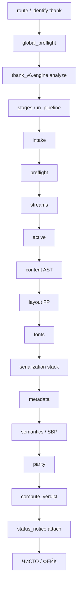

# T-BANK — VALIDATOR SPECIFICATION v6.0
## Как сейчас работает валидатор PDF-квитанций Т-Банка (фактическая реализация)

**Дата фиксации:** 20.07.2026  
**Статус:** Production (без rollout / shadow)  
**Проект:** `pdf-checker-bot`  
**Движок:** `tbank_v6` / `VALIDATOR_VERSION = "6.0.0"`  
**Сервер:** `85.192.40.122`, сервис `pdfbot`, бот `@proton_pdf_bot`  
**Источник истины:** код в `detector/tbank_v6/` + `detector/tbank_*.py`  
**Зонтичный документ:** `PDFCHECKER_VALIDATOR_SPEC_v1*.md`  
**Генератор фейков (чужой проект):** `TBANK_MASTER_SPEC_v7.md` / `samaya-ohuenaya-versiya`

---

## 0. Назначение

Этот документ описывает **только Т-Банк**: роутинг, pipeline, каталоги HARD/KNOWN/B/IGNORE, SBP-грамматику, шрифты/glyph, metadata, bot UX, атласы, деплой и регрессии — **как реально работает код на 20.07.2026**.

| Термин | Значение |
|--------|----------|
| `tbank_v6` | Единственный decision engine Т-Банка |
| `tbank_legacy` | Старый движок `0.6.3-v55` — **не** в вердикте |
| HARD (tier A) | Один флаг → **ФЕЙК** |
| KNOWN | Подтверждённая сигнатура → **ФЕЙК** |
| Supporting (tier B) | ФЕЙК только при **≥2 разных группах** |
| IGNORE / DELETED | Не влияют на вердикт |
| Novelty | Новый hash / subset / ФИО ≠ фейк |

**Главный принцип:** новизна ≠ подделка. ФЕЙК только при **межслойном противоречии** или **известной сигнатуре**.

---

## Содержание

1. [Главный принцип и запреты](#1-главный-принцип-и-запреты)
2. [Точка входа и роутинг](#2-точка-входа-и-роутинг)
3. [Карта файлов](#3-карта-файлов)
4. [Выходной словарь и типы](#4-выходной-словарь-и-типы)
5. [Бинарный verdict](#5-бинарный-verdict)
6. [Каталог правил](#6-каталог-правил)
7. [Pipeline по стадиям](#7-pipeline-по-стадиям)
8. [Модули-детекторы (детально)](#8-модули-детекторы-детально)
9. [СБП ID: структура и грамматика](#9-сбп-id-структура-и-грамматика)
10. [Шрифты и glyph](#10-шрифты-и-glyph)
11. [Metadata / keywords / generation](#11-metadata--keywords--generation)
12. [Корпусные профили и атласы](#12-корпусные-профили-и-атласы)
13. [Hardening для T-Bank](#13-hardening-для-t-bank)
14. [Telegram-бот](#14-telegram-бот)
15. [Reputation / enroll / analytics](#15-reputation--enroll--analytics)
16. [Деплой и регрессии](#16-деплой-и-регрессии)
17. [Запрещённые ложные признаки](#17-запрещённые-ложные-признаки)
18. [Расхождения со старыми спеками](#18-расхождения-со-старыми-спеками)
19. [Приложения](#19-приложения)

---

## 1. Главный принцип и запреты

| Параметр | Значение |
|----------|----------|
| Внешний вердикт | **ЧИСТО** / **ФЕЙК** |
| Score | **0** или **60** (`FAKE_THRESHOLD`) |
| Engine | `tbank_v6` |
| Rollout | нет — всегда live |

**Не банить за:**
- неизвестный FontFile2 SHA / glyf / loca hash
- «шрифт не из пула» / новый subset prefix
- новый trailer `/ID` / random keywords hash сами по себе
- новый размер страницы / высота шаблона
- render rows / pixel stripes
- SBP empirical один (`SBP_PROFILE_EMPIRICAL`) без второй supporting-группы

**Два слоя:**
1. Структурный — container, xref, streams, fonts, content AST  
2. Семантический — поля, SBP grammar, metadata lex, glyph integrity, cross-doc

---

## 2. Точка входа и роутинг

### 2.1. Общий поток

```
PDF bytes
  → detector/__init__.py::route()
       → fitz: text + producer
       → profiles.identify(...)          # key == "tbank"?
       → run_global_preflight()          # мгновенный HARD score 95
       → profiles.analyze_for("tbank")
            → detector/tbank.py
                 → tbank_v6.engine.analyze()
       → analyze_status(bank_key="tbank")  # status_notice только
  → (bank_name="Т-Банк", result, is_tbank=True)
```

**Важно:** для T-Bank **не** вызывается полный `run_hardening_v2` (router/global rules merge). Только global preflight + status engine.

### 2.2. Профиль — `profiles.py`

| Поле | Значение |
|------|----------|
| `key` | `"tbank"` |
| `name` | `"Т-Банк"` |
| Markers | `т-банк`, `тинькофф`, `tinkoff`, `tbank`, `tbank.ru`, `fb@tbank` |
| Producers | `jasperreports`, `openpdf` |
| `use_tbank_engine` | `True` |
| `min_score` | `0.4` |
| Boost | `fb@tbank` или (`pdfium` + `tbank` в тексте) → score **1.0** |

### 2.3. Обёртка — `detector/tbank.py`

```python
from .tbank_v6.engine import analyze, VALIDATOR_VERSION
# legacy _SIGNALS импортируется только для совместимости
```

Нет `rollout.py` — в отличие от Alfa/Ozon/VTB.

---

## 3. Карта файлов

### Decision engine (`tbank_v6/`)

| Файл | Роль |
|------|------|
| `engine.py` | Entry: SHA-256 → pipeline → verdict → expert_report |
| `stages.py` | Полный 11-стадийный pipeline |
| `verdict.py` | Бинарный ЧИСТО/ФЕЙК, `ingest_flag` |
| `rules.py` | HARD / KNOWN / SUPPORTING / IGNORED каталоги |
| `types.py` | `V6Flag`, `PipelineResult` |
| `explain.py` | Expert report для `@kronlead` |
| `known_signatures.py` | `K-FONT-001`, `K-FONT-002` |
| `__init__.py` | re-export `analyze` |

### Live-модули (вызываются из stages)

| Модуль | Назначение |
|--------|------------|
| `tbank_deflate_profile.py` | K-TBANK-DEFLATE-PROFILE-001 |
| `tbank_stream_serializer.py` | K-TBANK-STREAM-SERIALIZER-001 (remap → DEFLATE) |
| `tbank_flate_profile.py` | Flate / Java Deflater match |
| `tbank_stream_integrity.py` | целостность streams |
| `tbank_font_cid_closure.py` | CID closure |
| `tbank_used_glyph_integrity.py` | empty glyph + text parity |
| `tbank_glyph_slot_transplant.py` | slot transplant |
| `tbank_glyph_atlas.py` | atlas v3.0.0 |
| `tbank_reassembled_subset.py` | KNOWN reassembled assets |
| `tbank_font_table_integrity.py` | numGlyphs/loca/hmtx/checksum |
| `tbank_font_rebuilder.py` | combo → K-FONT-001 |
| `tbank_receipt_format.py` | номер квитанции `1-XXX-XXX-XXX-XXX` |
| `tbank_id_reuse.py` | trailer `/ID` reuse DB |
| `tbank_info_keywords_lex.py` | Info keywords lex |
| `tbank_keywords_generation.py` | generation mismatch (хвосты `991` / `DOCS-2035`) |
| `tbank_text_layout_fingerprint.py` | layout fingerprint (обычно B) |
| `tbank_sbp_content.py` | полная SBP-грамматика |
| `tbank_sbp_geometry.py` | геометрия SBP-колонки |
| `tbank_sbp_epoch_reuse.py` | epoch + stem (B) |
| `tbank_jasper_profile.py` | gate Jasper 6.20.3 / OpenPDF 1.3.30 |
| `tbank_spec.py` | в v6 — в основном `check_foreign_producer` |

### Не на decision path (legacy / dormant)

`tbank_legacy.py`, `tbank_corpus_spec.py`, `tbank_template_profile.py`, `tbank_font_stack.py`, `tbank_font_render.py`, `tbank_invariants.py`, большая часть старого `run_tbank_spec_checks`.

---

## 4. Выходной словарь и типы

### 4.1. `engine.analyze()` → dict

```python
{
  "verdict": "ЧИСТО" | "ФЕЙК",
  "emoji":   "✅" | "🔴",
  "score":   0 | 60,
  "flags":   ["[CODE] detail", ...],   # только decisive
  "details": {
     "file_hash",
     "validator_version": "6.0.0",
     "engine": "tbank_v6",
     "channel",                 # sbp | phone | card | …
     "receipt_subtype",
     "receipt_subtype_label",
     "completed_checks": [...],
     "stats": {...},
     "hard_count", "known_fake_count", "supporting_count",
     "ignored_observations": [...],
     "analysis_complete": bool,
     "expert_report": {...},
     "user_message": "Обнаружена подделка." | "Признаков подделки не найдено."
  }
}
```

### 4.2. `PipelineResult` / `V6Flag`

Флаги копятся в `hard_flags` / `known_fake_flags` / `supporting_flags` / `ignored_observations`.  
Также: `not_a_tbank_receipt`, `cross_document_identity_conflict`, `channel`, `receipt_subtype`, `stats`.

---

## 5. Бинарный verdict

`tbank_v6/verdict.py` — порядок строго такой:

```
1. !analysis_complete          → ФЕЙК [ANALYSIS_NOT_COMPLETED] score 60
2. not_a_tbank_receipt         → ФЕЙК [NOT_TBANK_RECEIPT] score 60
3. known_fake ∪ hard_flags     → ФЕЙК (все decisive lines) score 60
4. ≥2 distinct supporting groups → ФЕЙК (все B-flags) score 60
5. cross_document_identity_conflict → ФЕЙК [OPERATION_ID_REUSED] score 60
6. иначе                       → ЧИСТО score 0 flags=[]
```

`ingest_flag`:
- code ∈ KNOWN или tier=KNOWN → `known_fake_flags`
- tier=A или code ∈ HARD → `hard_flags`
- tier=B → `supporting_flags`
- иначе → `ignored_observations`

Один supporting-флаг **никогда** не даёт ФЕЙК.

---

## 6. Каталог правил

Источник: `detector/tbank_v6/rules.py`.

### 6.1. HARD (один → ФЕЙК)

**Container:**  
`ANALYSIS_NOT_COMPLETED`, `NOT_TBANK_RECEIPT`, `PDF_STRUCTURE_INVALID`, `MULTIPLE_PDF_HEADERS`, `TRAILER_INVALID`, `XREF_OFFSET_INVALID`, `MULTIPLE_STARTXREF_PRESENT`, `MULTIPLE_EOF_PRESENT`, `MULTIPLE_XREF_PRESENT`, `PREV_TRAILER_PRESENT`, `INCREMENTAL_UPDATE_PRESENT`, `DUPLICATE_ACTIVE_OBJECT_DEFINITION`, `BROKEN_OBJECT_STRUCTURE`, `TRAILING_DATA_AFTER_EOF`, `OBJECT_GRAPH_INCONSISTENT`

**Streams:**  
`STREAM_DECOMPRESSION_FAILED`, `STREAM_LENGTH_MISMATCH`, `UNEXPECTED_STREAM_FILTER`

**Active content:**  
`JAVASCRIPT_PRESENT`, `ACTIVE_CONTENT_PRESENT`, `OPENACTION_PRESENT`, `DANGEROUS_ACTION_PRESENT`, `EMBEDDED_FILE_PRESENT`, `EMBEDDED_PAYLOAD_PRESENT`, `ACROFORM_PRESENT`, `XFA_PRESENT`

**Visibility / text:**  
`TBANK_BT_ET_MISMATCH`, `TBANK_CONTENT_STREAM_EDIT`, `TEXT_LAYER_INCONSISTENT`, `BROKEN_CYRILLIC_MAPPING`, `TEXT_EXTRACTION_MAPPING_ANOMALY`, `UNICODE_MAPPING_INVALID`, `OVERLAY_DETECTED`, `OVERLAY_TEXT_LAYER`, `RECEIPT_TEXT_LAYER_MISSING`

**Fonts:**  
`USED_CID_MISSING_FROM_CMAP`, `USED_CID_MISSING_FROM_W`, `USED_CID_CMAP_MISMATCH`, `CMAP_W_MISMATCH`, `CMAP_INVALID`, `FONTFILE2_CID_MISSING`, `FONTFILE2_MISSING`, `MISSING_FONT_OBJECT`, `MISSING_WIDTH_TABLE`, `W_ARRAY_PRETTY_PRINTED`, `W_ARRAY_SERIALIZATION_ANOMALY`, `PDF_TTF_BBOX_CROSS_LAYER_MISMATCH`, `BROKEN_GLYPH_ZERO_LENGTH`, `USED_CID_EMPTY_GLYPH`, `GLYPH_SLOT_TRANSPLANT`, `TBANK_TEXT_GLYPH_PARITY`, `GLYPH_BBOX_IMPOSSIBLE`, `LOCA_TABLE_BROKEN`, `GLYPH_OUTLINE_MISMATCH`, `F3_NOT_ALSRUBL`, `TBANK_RUBLE_GLYPH_SPACING`, `TTF_CHECKSUM_ADJUSTMENT_INVALID`, `TTF_HMTX_COUNT_MISMATCH`, `W_MISSING_CID`, `TBANK_FONT_CID_CLOSURE_VIOLATION`, `TBANK_FONT_TABLE_INTEGRITY_VIOLATION`

**SBP / semantics:**  
`SBP_CIPHER_MISSING`, `SBP_CIPHER_STRUCTURE`, `SBP_CIPHER_TIMESTAMP`, `SBP_CIPHER_REFERENCE`, `SBP_ROUTE_FIELD_CONTAMINATION`, `SBP_CONTROL_TRIPLE_MISMATCH`, `SBP_LINKED_TUPLE_CONFLICT`, `SBP_GRAMMAR_SUFFIX_PROFILE`, `TBANK_SBP_GEOMETRY_MISMATCH`, `TBANK_GLYPH_RENDER_GEOMETRY_MISMATCH`, `FIELD_FORMAT_INVALID`, `STRING_FIELD_STRUCTURE_ANOMALY`, `FIELD_ORDER_MISMATCH`, `FIELD_SET_MISMATCH`, `MISSING_REQUIRED_FIELD_BLOCK`, `AMOUNT_MISMATCH_BETWEEN_TOTAL_AND_DETAILS`, `OPERATION_ID_REUSED`

**Provenance:**  
`TBANK_KNOWN_GENERATOR_SKELETON`, `TBANK_KEYWORDS_GENERATION_MISMATCH`, `TBANK_INFO_KEYWORDS_LEX_MISMATCH`, `MIXED_FLATE_SERIALIZER_PROVENANCE`, `TBANK_DEFLATE_PROFILE_MISMATCH`, `TBANK_RECEIPT_NUMBER_FORMAT`, `TBANK_TRAILER_ID_REUSED`, `TBANK_STREAM_INTEGRITY_VIOLATION`, `TBANK_FOREIGN_PRODUCER`, `FOREIGN_PRODUCER`

### 6.2. KNOWN

| Code | Смысл |
|------|--------|
| `K-FONT-001` | Font rebuilder combo (окно ~180s) |
| `K-FONT-002` | Точная пара F2 glyf/loca SHA |
| `KNOWN_FAKE_SBP_GRAMMAR_COMBINATION` | запретная SBP-комбинация `*60501` |
| `TBANK_REASSEMBLED_BANK_ASSETS` | пересобранные банковские assets |

`K_FONT_002_GLYF_SHA` / `K_FONT_002_LOCA_SHA` — фиксированные digests в `rules.py`.

`KNOWN_GENERATOR_SKELETONS` — 6 hex content-skeleton hashes → `TBANK_KNOWN_GENERATOR_SKELETON`.

### 6.3. Supporting (tier B) — группы

| Группа | Коды |
|--------|------|
| `B6_metadata_version` | `PDF_MODDATE_EDITED`, `TBANK_SHELL_PRODUCER/CREATOR/SUBJECT_MISMATCH` |
| `B1_serializer_container` | `STREAM_COMPRESSION_RATIO_OUTLIER`, `DECODED_STREAM_SIZE_OUTLIER`, `STREAM_FILTER_ANOMALY` |
| `B5_source_fonts` | `TTF_NUMGLYPHS_MISMATCH`, `TTF_HEAD_ANOMALY`, `TTF_HMTX_PROFILE_SHIFT`, `UNUSED_CID_PRESENT`, `CMAP_EXTRA_SYMBOLS` |
| `B5_font_rebuilder` | `FONT_GLOBAL_TABLES_FOREIGN_SUBSETTER`, `STATIC_EDITABLE_DIGIT_SUBSET_F2`, `KNOWN_FAKE_FONT_REBUILDER_SIGNATURE`, `EXTRA_UNUSED_GLYPHS_F1_F2` |
| `content_grammar_layout` | `TBANK_TEXT_LAYOUT_FINGERPRINT` |
| `content_grammar_sbp` | `SBP_PROFILE_EMPIRICAL` |
| `content_grammar_sbp_epoch` | `SBP_PROFILE_EPOCH_MISMATCH` |
| `cross_document_receipt_stem` | `RECEIPT_STEM_REUSE_CONFLICT` |

### 6.4. IGNORED / DELETED

Render-rows, template height/stream/operator drifts, F1/F2/F3 profile drifts, `FF2_SUBSET_UNKNOWN`, coordinate/baseline drifts, `FONT_AUTH_FOREIGN_FONT`, и т.д. — полный список в `IGNORED_CODES`.

`_FORENSICS_STATS_ONLY` — HIGH-forensics, которые в v6 остаются stats-only (не вердикт).

### 6.5. Runtime remap

`MIXED_FLATE_SERIALIZER_PROVENANCE` эмитится serializer-модулем, но wrapper `check_deflate_profile` **переписывает** в `TBANK_DEFLATE_PROFILE_MISMATCH` при live-пути.

---

## 7. Pipeline по стадиям

`stages.run_pipeline` (`stages.py` ~746–781):

| # | Стадия | `completed_checks` | Что делает |
|---|--------|--------------------|------------|
| 1 | `_stage_intake` | `intake` | пустой файл / size > **8_000_000** → incomplete |
| 2 | `_stage_preflight` | `raw_preflight` | structure, incremental, xref; `/Encrypt` → incomplete |
| 3 | `_stage_streams` | `streams` | decompress/length HARD; outliers → B |
| 4 | `_stage_active_content` | `active_content` | JS/OpenAction/embed/… |
| 5 | `_stage_content_ast` | `content_ast` | BT/ET, content edit, known skeletons |
| 6 | `_stage_layout_fingerprint` | `layout_fingerprint` | text layout fingerprint |
| 7 | `_stage_fonts` | `fonts_cmap_glyph` | K-FONT, forensics, F3 ALSRubl |
| 8 | `_stage_internal_serialization` | `internal_serialization` | см. ниже |
| 9 | `_stage_metadata` | `metadata_generation` | keywords lex + generation |
| 10 | `_stage_semantics` | `semantic_geometry` | channel, foreign producer, SBP, anti-edit |
| 11 | `_stage_parity` | `differential_parity` | два parser vs SBP-ID |
| 12 | (маркер) | `cross_document_intelligence` | после parity |

### Стадия 8 — порядок внутри

```
deflate (+ serializer remapped)
→ stream integrity
→ CID closure
→ used-glyph integrity
→ glyph slot transplant
→ glyph atlas
→ reassembled bank assets (KNOWN)
→ font table integrity
→ receipt number format
→ trailer /ID reuse
```

---

## 8. Модули-детекторы (детально)

### 8.1. Jasper gate

`tbank_jasper_profile.py` — `PROFILE_ID = jasper_6.20.3_openpdf_1.3.30_ib_receipt`.  
Многие SBP/geometry проверки требуют подтверждённый Jasper/OpenPDF-профиль.

### 8.2. Deflate / serializer

- Канонический Java Deflater profile для content streams  
- Неканоническая / смешанная сериализация → `TBANK_DEFLATE_PROFILE_MISMATCH`  
- RULE: `K-TBANK-DEFLATE-PROFILE-001`, `K-TBANK-STREAM-SERIALIZER-001`

### 8.3. Stream integrity

Границы Flate, length vs decoded, ambiguous members → `TBANK_STREAM_INTEGRITY_VIOLATION`.

### 8.4. Font CID closure / tables

Used CID → CMap → /W → FontFile2 → GID → loca/glyf/hmtx.  
Таблица: numGlyphs, loca, checksumAdjustment, hmtx count.

### 8.5. Used glyph / slot transplant / atlas

- Пустой glyf у used CID → `USED_CID_EMPTY_GLYPH`  
- Паритет Отправитель/Получатель → `TBANK_TEXT_GLYPH_PARITY`  
- Трансплант слота → `GLYPH_SLOT_TRANSPLANT`  
- Atlas v3: Unicode→CID→GID→glyf→/W→fitz, tol **0.75 pt**

### 8.6. Reassembled assets

KNOWN `TBANK_REASSEMBLED_BANK_ASSETS` — подтверждённая пересборка банковских ресурсов.

### 8.7. Receipt number

Regex: `^1-\d{3}-\d{3}-\d{3}-\d{3}$` → иначе `TBANK_RECEIPT_NUMBER_FORMAT`.

### 8.8. Trailer `/ID` reuse

SQLite `tbank_id_reuse.db`: тот же `/ID`, другой контент → `TBANK_TRAILER_ID_REUSED`.

### 8.9. Foreign producer

`FOREIGN_PRODUCER` / `TBANK_FOREIGN_PRODUCER` — **HARD** (не supporting), если заявлен T-Bank, а producer чужой.

### 8.10. Known skeletons

Content skeleton hash ∈ `KNOWN_GENERATOR_SKELETONS` → `TBANK_KNOWN_GENERATOR_SKELETON`.

---

## 9. СБП ID: структура и грамматика

Модуль: `tbank_sbp_content.py` (+ geometry / epoch).

### 9.1. Раскладка 32 символов

| Срез | Поле |
|------|------|
| `[0]` | lead `A`/`B` |
| `[1]` | year digit |
| `[2:5]` | UTC day-of-year |
| `[5:11]` | UTC HMS |
| `[11:14]` | ref3 |
| `[14]` | route_marker |
| `[15]` | control |
| `[16]` | separator = **`0`** |
| `[17:19]` | class: `00` / `B0` / `B1` / `G1` (lead ∈ `{0,B,G}`) |
| `[19:22]` | slot |
| `[22:26]` | profile_block = **`0011`** |
| `[22:27]` | bank5 |
| `[26:32]` | suffix |

### 9.2. Правила

| Code | Tier | Условие |
|------|------|---------|
| `SBP_CIPHER_MISSING` | A | нет opid |
| `SBP_CIPHER_STRUCTURE` | A | len≠32 / charset / profile≠0011 / time digits |
| `SBP_CIPHER_TIMESTAMP` | A | ID→MSK vs напечатанное время, Δ>1s |
| `SBP_ROUTE_FIELD_CONTAMINATION` | A | sep≠0 / lead∉{0,B,G} / class mismatch |
| `SBP_LINKED_TUPLE_CONFLICT` | A | ключ `(B1,00117,1,013,760501)` → marker must be `1` |
| `SBP_CONTROL_TRIPLE_MISMATCH` | A | только профили `(00,00116)` / `(B0,00116)`; control ≠ corpus |
| `KNOWN_FAKE_SBP_GRAMMAR_COMBINATION` | KNOWN | `*60501` на запретных `(00,00116)`/`(G1,00117)` + bad marker |
| `SBP_GRAMMAR_SUFFIX_PROFILE` | A | `*60501` на forbidden pair без dual marker fail |
| `SBP_PROFILE_EMPIRICAL` | B | marker/suffix ∉ empirical set для `(class,bank5)` |
| `SBP_PROFILE_EPOCH_MISMATCH` | B | профиль «протух»; ID+visible > **21** дня после last corpus date |
| `RECEIPT_STEM_REUSE_CONFLICT` | B | stem корпуса + изменённые DDD/opid/date |
| `TBANK_SBP_GEOMETRY_MISMATCH` | A | правый край vs колонка ~**250 pt** (tol 0.05, окно 235–265) |

### 9.3. Empirical-профили корпуса

| (class, bank5) | n | markers | примеры suffixes |
|----------------|---|---------|------------------|
| `(G1, 00117)` | 24 | `0`,`1` | `730902`, `770402`, `770901`, `791103` |
| `(00, 00116)` | 9 | `0`,`1` | `640702`, `661101`, `670301`, `680301`, `681101` |
| `(B1, 00117)` | 20 | `0`,`1` | `700501`, `730501`, `760501`, `770302`, `770901`, `790502` |
| `(B0, 00116)` | 2 | `6`,`7` | `680301` |

Полные `triple_control` / `linked_tuples` — в `tbank_sbp_content.py` `_EMPIRICAL_PROFILES`.

**Не применяются** к T-Bank правила SBP Ozon/Alfa/Sber без отдельного контракта.

---

## 10. Шрифты и glyph

Шрифты чека: **F1** Regular, **F2** Medium, **F3** ALSRubl.

| Слой | Модуль | Роль |
|------|--------|------|
| Atlas v3 | `tbank_glyph_atlas.py` | `_ATLAS_VERSION="3.0.0"`, tol 0.75 pt |
| Used CID | `tbank_used_glyph_integrity.py` | empty glyf, name parity |
| Slot | `tbank_glyph_slot_transplant.py` | canon JSON |
| Rebuilder | `tbank_font_rebuilder.py` | → K-FONT-001, окно 180s |
| K-FONT-002 | `known_signatures.py` | exact F2 glyf/loca SHA |
| CID closure | `tbank_font_cid_closure.py` | font_layers + FontFile2 |
| Tables | `tbank_font_table_integrity.py` | maxp/loca/hmtx/checksum |
| Shared | `font_layers.py`, `glyf_fingerprint.py`, `ff2_pool.py`, `pdf_forensics` | |

**PDF↔TTF BBox:** `PDF_TTF_BBOX_CROSS_LAYER_MISMATCH` (cross-layer HARD).

F3 не ALSRubl → `F3_NOT_ALSRUBL`.

---

## 11. Metadata / keywords / generation

| Модуль | Code | Условие |
|--------|------|---------|
| `tbank_info_keywords_lex.py` | `TBANK_INFO_KEYWORDS_LEX_MISMATCH` | lex Info keywords |
| `tbank_keywords_generation.py` | `TBANK_KEYWORDS_GENERATION_MISMATCH` | поколение keywords |

Константы generation:
- `TRANSITION_DATETIME = 2026-07-10`
- старый хвост `991`, новый `DOCS-2035`

ModDate edit / shell producer/creator/subject mismatch — обычно **tier B** (`B6_metadata_version`), кроме foreign producer (HARD).

---

## 12. Корпусные профили и атласы

| Asset | Путь / значение |
|-------|-----------------|
| Profile version | `corpus_profiles.py` → `tbank_corpus_41_spec_2026_06` |
| Channels | `CHANNEL_SBP` / `PHONE` / `CARD` |
| Glyph atlas | `detector/atlas_data/tbank_glyph_atlas_{F1,F2,F3}.json` (+ index) |
| Subset builder | `tbank_subset_builder_atlas.json` |
| Slot canon | `tbank_glyph_slot_canon.json` |
| Epoch/stems | `tbank_sbp_epoch_stems.json` |
| Reassembled | `tbank_reassembled_subset.json` |
| Template data | `detector/data/tbank_template/` |
| ID reuse DB | `tbank_id_reuse.db` (runtime) |
| Jasper PROFILE_ID | `jasper_6.20.3_openpdf_1.3.30_ib_receipt` |

---

## 13. Hardening для T-Bank

1. `run_global_preflight` — polyglot / global HARD (score 95 вне v6)  
2. **Не** полный `run_hardening_v2`  
3. `analyze_status(bank_key="tbank")` → `status_notice` (неуспешно / в обработке) без смены authenticity score v6  
4. Бот отдельно рисует «Перевод не выполнен» при failed status

`status_optional("tbank")` = False — статус ожидается, где есть.

---

## 14. Telegram-бот

- Парсинг полей: `parser.parse` (T-Bank blocks)  
- Обычный UX: поля + **Оригинал** / **Подделка** / **Перевод не выполнен**  
- Verbose (`@kronlead` / admin): `details.engine=="tbank_v6"` → `expert_report.body_lines`  
- Stale receipt (>7 дней) — предупреждение, не ФЕЙК  
- `FAKE_THRESHOLD = 60` также в `bot.py`

Expert report (`explain.py`) фильтрует запрещённые формулировки (render rows и т.п.).

---

## 15. Reputation / enroll / analytics

| Подсистема | T-Bank |
|------------|--------|
| Reputation | SBP-id калибровка под формат T-Bank; known-fake hash БД |
| Enroll | `tbank_enroll.enroll_tbank_original` при подтверждении «Это оригинал» |
| Analytics | log_check с bank/verdict/score |
| Campaign | Т-Банк **исключён** из campaign banks |

---

## 16. Деплой и регрессии

### Деплой

`tools/_deploy_v6.py` — SFTP `tbank_v6/*`, связанные `tbank_*.py`, `atlas_data/`, restart `pdfbot`.

### Регрессии / probes

| Tool | Назначение |
|------|------------|
| `_v6_regression.py` | основной корпус v6 |
| `_tbank_empirical_regression.py` | SBP empirical |
| `_tbank_linked_tuple_regression.py` | linked tuple |
| `_tbank_sbp_route_marker_regression.py` | route marker |
| `_tbank_layout_regression.py` / `_tbank_layout_stage2.py` | layout |
| `_tbank_glyph_atlas_regression.py` | glyph atlas |
| `_tbank_used_glyph_regression.py` | used glyphs |
| `_stream_serializer_regression.py` | serializer/deflate |
| Builders | `build_tbank_glyph_atlas.py`, `build_glyph_slot_canon.py`, `build_tbank_sbp_epoch_stems.py`, `build_tbank_reassembled_subset.py`, … |

---

## 17. Запрещённые ложные признаки

- Не банить за новый SHA / object count / page height / QR  
- Не банить за неизвестный FontFile2 / subset без contradiction  
- Не использовать render rows / «чужие полосы» / pixel fingerprints  
- Не суммировать soft B-флаги в ФЕЙК по одному  
- Incremental update сам по себе ≠ HARD без конфликта контента  
- Не auto-blacklist по собственному вердикту ФЕЙК  
- Не применять SBP-правила других банков  

---

## 18. Расхождения со старыми спеками

| Тема | Старый зонтик / v7 | Код сейчас |
|------|--------------------|------------|
| `run_pipeline` line refs | ~682–717 | **746–781** |
| Stage 8 | без reassembled | есть `check_reassembled_bank_assets` |
| `FOREIGN_PRODUCER` | иногда как B | **HARD** (+ `TBANK_FOREIGN_PRODUCER`) |
| `MIXED_FLATE_…` | отдельный HARD | live remap → `TBANK_DEFLATE_PROFILE_MISMATCH` |
| Внешний ярлык | ОРИГИНАЛ | **ЧИСТО** (expert может писать ОРИГИНАЛ) |
| Rollout | — | нет, всегда full |

При конфликте: **код production важнее** текста старого документа.

---

## 19. Приложения

### A. Диаграмма



### B. Ключевые константы

| Константа | Где | Значение |
|-----------|-----|----------|
| `VALIDATOR_VERSION` | `tbank_v6/engine.py` | `"6.0.0"` |
| `FAKE_THRESHOLD` | `tbank_v6/verdict.py` | `60` |
| `_MAX_BYTES` | `stages.py` | `8_000_000` |
| `TRANSITION_DATETIME` | `tbank_keywords_generation.py` | `2026-07-10` |
| `OLD_TAIL` / `NEW_TAIL` | same | `991` / `DOCS-2035` |
| `_HISTORICAL_GAP_DAYS` | `tbank_sbp_epoch_reuse.py` | `21` |
| `_TARGET_RIGHT_PT` | `tbank_text_layout_fingerprint.py` | `250.0` |
| SBP geometry R | `tbank_sbp_geometry.py` | 250 ± tol |
| `_ATLAS_VERSION` | `tbank_glyph_atlas.py` | `"3.0.0"` |
| `PROFILE_VERSION` | `corpus_profiles.py` | `tbank_corpus_41_spec_2026_06` |
| Receipt regex | `tbank_receipt_format.py` | `^1-\d{3}-\d{3}-\d{3}-\d{3}$` |
| Legacy version | `tbank_legacy.py` | `"0.6.3-v55"` (не в вердикте) |

### C. `completed_checks`

```
intake
raw_preflight
streams
active_content
content_ast
layout_fingerprint
fonts_cmap_glyph
internal_serialization
metadata_generation
semantic_geometry
differential_parity
cross_document_intelligence
```

### D. Связанные документы

- `PDFCHECKER_VALIDATOR_SPEC_v1*.md` — зонтик по всем банкам  
- `OZON_BANK_VALIDATOR_SPEC_v1.md` — только Ozon  
- `TBANK_MASTER_SPEC_v7.md` — генератор (чужой проект)  

---

**Конец документа.**  
Любое изменение поведения T-Bank-валидатора должно обновлять этот файл **и** код в `detector/tbank_v6/` / `detector/tbank_*.py`.
