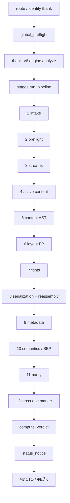

# T-BANK — ПОЛНАЯ СПЕЦИФИКАЦИЯ ВАЛИДАТОРА v7.0

## Как работает валидатор PDF-квитанций Т-Банка (фактическая реализация, production)

**Дата фиксации:** 21.07.2026  
**Статус:** Production (без rollout / shadow)  
**Проект:** `pdf-checker-bot`  
**Движок:** `tbank_v6` / `VALIDATOR_VERSION = "6.0.0"`  
**Сервер:** Aeza `85.192.40.122`, сервисы `pdfbot` + `pdfmail`, бот `@proton_pdf_bot`  
**Источник истины:** код в `detector/tbank_v6/` + `detector/tbank_*.py` + `detector/embedded_font_reassembly.py`  
**Предыдущая версия документа:** `TBANK_VALIDATOR_SPEC_v6.md` (20.07.2026)  
**Зонтичный документ:** `PDFCHECKER_VALIDATOR_SPEC_v1*.md`

---

## 0. Назначение документа

Этот документ описывает **весь** валидатор Т-Банка: роутинг, 12-стадийный pipeline, каждый модуль-детектор, каталоги HARD / KNOWN / tier-B / IGNORE, SBP-грамматику, шрифты и glyph-цепочки, metadata, cross-document intelligence, embedded font reassembly forensics, Telegram UX, атласы, enroll, деплой и регрессии — **как реально работает код на 21.07.2026**.

Документ предназначен для разработчиков, аналитиков и для согласования с генераторами фейков (чужой проект `TBANK_MASTER_SPEC_v7.md`).

### 0.1. Термины

| Термин | Значение |
|--------|----------|
| `tbank_v6` | Единственный decision engine Т-Банка |
| `tbank_legacy` | Старый движок `0.6.3-v55` — **не** участвует в вердикте |
| HARD (tier A) | Один флаг → внешний вердикт **ФЕЙК** |
| KNOWN | Подтверждённая malicious signature → **ФЕЙК** |
| Supporting (tier B) | **ФЕЙК** только при **≥2 разных группах** B-флагов |
| IGNORE / DELETED | Не влияют на вердикт; попадают в `ignored_observations` |
| Novelty | Новый hash / subset / ФИО / trailer `/ID` ≠ фейк |
| Profile gate | Многие HARD-проверки работают только при подтверждённом Jasper/OpenPDF IB/Receipt профиле |
| `completed_checks` | Маркеры пройденных стадий pipeline (для expert report и отладки) |

### 0.2. Главный принцип

**Новизна ≠ подделка.** Внешний вердикт **ФЕЙК** выдаётся только при:

1. **межслойном противоречии** (PDF container ↔ streams ↔ fonts ↔ text ↔ SBP ↔ metadata), или  
2. **известной malicious signature** (KNOWN), или  
3. **≥2 независимых supporting-группах** tier B.

Score бинарный: **0** (ЧИСТО) или **60** (`FAKE_THRESHOLD`).

---

## Содержание

1. [Точка входа и роутинг](#1-точка-входа-и-роутинг)
2. [Карта файлов](#2-карта-файлов)
3. [Выходной словарь](#3-выходной-словарь)
4. [Бинарный verdict](#4-бинарный-verdict)
5. [Каталог правил (полный)](#5-каталог-правил-полный)
6. [Pipeline по стадиям](#6-pipeline-по-стадиям)
7. [Стадия 1–4: intake, preflight, streams, active content](#7-стадии-1–4)
8. [Стадия 5: content AST](#8-стадия-5-content-ast)
9. [Стадия 6: layout fingerprint](#9-стадия-6-layout-fingerprint)
10. [Стадия 7: fonts / CMap / glyph](#10-стадия-7-fonts--cmap--glyph)
11. [Стадия 8: internal serialization (полный стек)](#11-стадия-8-internal-serialization)
12. [Стадия 9: metadata / keywords generation](#12-стадия-9-metadata)
13. [Стадия 10: semantics / SBP / anti-edit](#13-стадия-10-semantics)
14. [Стадии 11–12: parity и cross-document](#14-стадии-11–12)
15. [СБП ID: структура и грамматика (полностью)](#15-сбп-id)
16. [Шрифты F1/F2/F3 и glyph-цепочки](#16-шрифты)
17. [Embedded font reassembly forensics](#17-embedded-font-reassembly-forensics)
18. [Jasper/OpenPDF profile gate](#18-jasperopenpdf-profile-gate)
19. [Корпусные профили и атласы](#19-корпусные-профили-и-атласы)
20. [Hardening, status engine, Telegram-бот](#20-hardening-telegram)
21. [Reputation, enroll, analytics](#21-reputation-enroll)
22. [Деплой и регрессии](#22-деплой-и-регрессии)
23. [Запрещённые ложные признаки](#23-запрещённые-ложные-признаки)
24. [Расхождения со старыми спеками](#24-расхождения)
25. [Приложения: константы, диаграммы, completed_checks](#25-приложения)

---

## 1. Точка входа и роутинг

### 1.1. Общий поток

```
PDF bytes
  → detector/__init__.py::route()
       → fitz: text + producer
       → profiles.identify(text, producer)     # key == "tbank"?
       → run_global_preflight()               # мгновенный HARD score 95 (вне v6)
       → profiles.analyze_for("tbank")
            → detector/tbank.py
                 → tbank_v6.engine.analyze()
       → analyze_status(bank_key="tbank")     # status_notice только
  → (bank_name="Т-Банк", result, is_tbank=True)
```

**Важно для T-Bank:**

- **Не** вызывается полный `run_hardening_v2` (router/global rules merge).
- Только `run_global_preflight` + status engine.
- Нет `rollout.py` — в отличие от Alfa/Ozon/VTB, движок всегда live.

### 1.2. Идентификация банка — `profiles.py`

| Поле | Значение |
|------|----------|
| `key` | `"tbank"` |
| `name` | `"Т-Банк"` |
| Markers | `т-банк`, `тинькофф`, `tinkoff`, `tbank`, `tbank.ru`, `fb@tbank` |
| Producers | `jasperreports`, `openpdf` |
| `use_tbank_engine` | `True` |
| `min_score` | `0.4` |
| Boost | `fb@tbank` или (`pdfium` + `tbank` в тексте) → score **1.0** |

### 1.3. Обёртка — `detector/tbank.py`

```python
from .tbank_v6.engine import analyze, VALIDATOR_VERSION
# legacy _SIGNALS импортируется только для совместимости alfa/sber/full_bank
```

Legacy `tbank_legacy.py` (`0.6.3-v55`) **не вызывается** в decision path.

### 1.4. Условие «это квитанция Т-Банка»

Функция `_is_tbank_receipt()` в `stages.py`:

1. В PDF есть `/Subject` → `/reports/IB/Receipt`, **или**
2. В тексте ≥2 маркеров из: `Перевод`, `Квитанция`, `Итого`, `Статус`, **или**
3. В бинарнике есть `Receipt` / UTF-8 `Перевод` (fallback без fitz-текста).

Если после semantics файл не распознан как чек → `not_a_tbank_receipt` → **ФЕЙК** `[NOT_TBANK_RECEIPT]`.

---

## 2. Карта файлов

### 2.1. Decision engine (`detector/tbank_v6/`)

| Файл | Роль |
|------|------|
| `engine.py` | Entry: SHA-256 → pipeline → verdict → expert_report |
| `stages.py` | Полный 12-стадийный pipeline (~800 строк) |
| `verdict.py` | Бинарный ЧИСТО/ФЕЙК, `ingest_flag`, `FAKE_THRESHOLD=60` |
| `rules.py` | HARD / KNOWN / SUPPORTING / IGNORED каталоги |
| `types.py` | `V6Flag`, `PipelineResult` |
| `explain.py` | Expert report для `@kronlead` / admin |
| `known_signatures.py` | `K-FONT-001`, `K-FONT-002` |
| `__init__.py` | re-export `analyze` |

### 2.2. Live-модули (вызываются из stages)

| Модуль | RULE ID / назначение |
|--------|----------------------|
| `structure.py` | Container, xref, streams, active content, skeleton hash |
| `pdf_forensics.py` | Shared font/CMap/W/FontFile2 forensics (`bank="tbank"`) |
| `tbank_deflate_profile.py` | `K-TBANK-DEFLATE-PROFILE-001` |
| `tbank_stream_serializer.py` | `K-TBANK-STREAM-SERIALIZER-001` (remap → DEFLATE) |
| `tbank_flate_profile.py` | Flate stream enumeration, Java Deflater canonical match |
| `tbank_stream_integrity.py` | `TBANK_STREAM_INTEGRITY_VIOLATION` |
| `tbank_font_cid_closure.py` | CID → CMap → /W → FontFile2 → GID closure |
| `tbank_used_glyph_integrity.py` | `USED_CID_EMPTY_GLYPH`, `TBANK_TEXT_GLYPH_PARITY` |
| `tbank_glyph_slot_transplant.py` | `GLYPH_SLOT_TRANSPLANT` |
| `tbank_glyph_atlas.py` | Atlas v3.0.0, `TBANK_GLYPH_RENDER_GEOMETRY_MISMATCH` |
| `tbank_reassembled_subset.py` | KNOWN `TBANK_REASSEMBLED_BANK_ASSETS` (+ v2) |
| `embedded_font_reassembly.py` | KNOWN `TBANK_REBUILD_*` (5 кодов) |
| `tbank_font_table_integrity.py` | numGlyphs/loca/hmtx/checksum |
| `tbank_font_rebuilder.py` | Combo → `K-FONT-001` |
| `tbank_receipt_format.py` | `TBANK_RECEIPT_NUMBER_FORMAT` |
| `tbank_id_reuse.py` | `TBANK_TRAILER_ID_REUSED` (SQLite) |
| `tbank_info_keywords_lex.py` | `TBANK_INFO_KEYWORDS_LEX_MISMATCH` |
| `tbank_keywords_generation.py` | `TBANK_KEYWORDS_GENERATION_MISMATCH` |
| `tbank_text_layout_fingerprint.py` | `TBANK_TEXT_LAYOUT_FINGERPRINT` (B/HARD dual) |
| `tbank_sbp_content.py` | Полная SBP-грамматика |
| `tbank_sbp_geometry.py` | `TBANK_SBP_GEOMETRY_MISMATCH` |
| `tbank_sbp_epoch_reuse.py` | `SBP_PROFILE_EPOCH_MISMATCH`, `RECEIPT_STEM_REUSE_CONFLICT` (B) |
| `tbank_jasper_profile.py` | Gate Jasper 6.20.3 / OpenPDF 1.3.30 |
| `tbank_spec.py` | `FOREIGN_PRODUCER` (доп. проверка producer) |
| `anti_edit.py` | `OPERATION_ID_REUSED`, `PDF_MODDATE_EDITED`, overlay |
| `sbp_cipher.py` | Shared extractors datetime / opid |
| `font_layers.py`, `glyf_fingerprint.py`, `ff2_pool.py` | Shared font plumbing |

### 2.3. Не на decision path (legacy / dormant / stats-only)

`tbank_legacy.py`, `tbank_corpus_spec.py`, `tbank_template_profile.py`, `tbank_font_stack.py`, `tbank_font_render.py`, `tbank_invariants.py`, `tbank_sbp_cipher.py` (старый), большая часть `run_tbank_spec_checks` из `tbank_spec.py`.

Коды `TBANK_RENDER_*`, `TBANK_TEMPLATE_*`, `TBANK_F*_DRIFT` — в `IGNORED_CODES`, не влияют на вердикт.

---

## 3. Выходной словарь

### 3.1. `engine.analyze(pdf_bytes, file_hash="", privileged_user=False)`

```python
{
  "verdict": "ЧИСТО" | "ФЕЙК",
  "emoji":   "✅" | "🔴",
  "score":   0 | 60,
  "flags":   ["[CODE] detail", ...],   # только decisive (HARD + KNOWN + B при ≥2 группах)
  "details": {
     "file_hash": str,
     "validator_version": "6.0.0",
     "engine": "tbank_v6",
     "channel": "sbp" | "phone" | "card" | ...,
     "receipt_subtype": str,
     "receipt_subtype_label": str,
     "completed_checks": [...],
     "stats": { ... },                  # полная телеметрия всех модулей
     "hard_count": int,
     "known_fake_count": int,
     "supporting_count": int,
     "ignored_observations": [...],
     "analysis_complete": bool,
     "expert_report": {
         "summary": str,
         "body_lines": [...],
         "ignored": [...],
         "decisive_count": int,
     },
     "user_message": "Обнаружена подделка." | "Признаков подделки не найдено."
  }
}
```

Параметр `privileged_user` в engine **не меняет** verdict — только bot решает, показывать ли `expert_report`.

### 3.2. `PipelineResult` / `V6Flag`

```python
@dataclass
class V6Flag:
    code: str
    detail: str
    tier: str          # "A" | "B" | "KNOWN" | "IGNORE"
    group: str         # supporting group name
    rule_id: str

@dataclass
class PipelineResult:
    file_hash: str
    analysis_complete: bool = True
    not_a_tbank_receipt: bool = False
    cross_document_identity_conflict: bool = False
    channel: str = ""
    receipt_subtype: str = ""
    completed_checks: list[str]
    hard_flags: list[V6Flag]
    known_fake_flags: list[V6Flag]
    supporting_flags: list[V6Flag]
    ignored_observations: list[str]
    stats: dict
```

---

## 4. Бинарный verdict

`tbank_v6/verdict.py` — порядок **строго фиксирован**:

```
1. !analysis_complete          → ФЕЙК [ANALYSIS_NOT_COMPLETED] score 60
2. not_a_tbank_receipt         → ФЕЙК [NOT_TBANK_RECEIPT] score 60
3. known_fake ∪ hard_flags     → ФЕЙК (все decisive lines) score 60
4. ≥2 distinct supporting groups → ФЕЙК (все B-flags) score 60
5. cross_document_identity_conflict → ФЕЙК [OPERATION_ID_REUSED] score 60
6. иначе                       → ЧИСТО score 0, flags=[]
```

### 4.1. `ingest_flag(result, flag)`

| Условие | Куда попадает |
|---------|---------------|
| `code ∈ KNOWN_FAKE_CODES` или `tier == "KNOWN"` | `known_fake_flags` |
| `tier == "A"` или `code ∈ HARD_CODES` | `hard_flags` |
| `tier == "B"` | `supporting_flags` |
| иначе | `ignored_observations` |

**Один supporting-флаг никогда не даёт ФЕЙК.**

### 4.2. Supporting groups (для правила ≥2)

| Группа | Коды |
|--------|------|
| `B6_metadata_version` | `PDF_MODDATE_EDITED`, `TBANK_SHELL_PRODUCER_MISMATCH`, `TBANK_SHELL_CREATOR_MISMATCH`, `TBANK_SHELL_SUBJECT_MISMATCH` |
| `B1_serializer_container` | `STREAM_COMPRESSION_RATIO_OUTLIER`, `DECODED_STREAM_SIZE_OUTLIER`, `STREAM_FILTER_ANOMALY` |
| `B5_source_fonts` | `TTF_NUMGLYPHS_MISMATCH`, `TTF_HEAD_ANOMALY`, `TTF_HMTX_PROFILE_SHIFT`, `UNUSED_CID_PRESENT`, `CMAP_EXTRA_SYMBOLS` |
| `B5_font_rebuilder` | `FONT_GLOBAL_TABLES_FOREIGN_SUBSETTER`, `STATIC_EDITABLE_DIGIT_SUBSET_F2`, `KNOWN_FAKE_FONT_REBUILDER_SIGNATURE`, `EXTRA_UNUSED_GLYPHS_F1_F2` |
| `content_grammar_layout` | `TBANK_TEXT_LAYOUT_FINGERPRINT` |
| `content_grammar_sbp` | `SBP_PROFILE_EMPIRICAL` |
| `content_grammar_sbp_epoch` | `SBP_PROFILE_EPOCH_MISMATCH` |
| `cross_document_receipt_stem` | `RECEIPT_STEM_REUSE_CONFLICT` |

---

## 5. Каталог правил (полный)

Источник: `detector/tbank_v6/rules.py`.

### 5.1. HARD (tier A) — один флаг → ФЕЙК

**Container / corruption:**  
`ANALYSIS_NOT_COMPLETED`, `NOT_TBANK_RECEIPT`, `PDF_STRUCTURE_INVALID`, `MULTIPLE_PDF_HEADERS`, `TRAILER_INVALID`, `XREF_OFFSET_INVALID`, `MULTIPLE_STARTXREF_PRESENT`, `MULTIPLE_EOF_PRESENT`, `MULTIPLE_XREF_PRESENT`, `PREV_TRAILER_PRESENT`, `INCREMENTAL_UPDATE_PRESENT`, `DUPLICATE_ACTIVE_OBJECT_DEFINITION`, `BROKEN_OBJECT_STRUCTURE`, `TRAILING_DATA_AFTER_EOF`, `OBJECT_GRAPH_INCONSISTENT`

**Streams:**  
`STREAM_DECOMPRESSION_FAILED`, `STREAM_LENGTH_MISMATCH`, `UNEXPECTED_STREAM_FILTER`

**Active content:**  
`JAVASCRIPT_PRESENT`, `ACTIVE_CONTENT_PRESENT`, `OPENACTION_PRESENT`, `DANGEROUS_ACTION_PRESENT`, `EMBEDDED_FILE_PRESENT`, `EMBEDDED_PAYLOAD_PRESENT`, `ACROFORM_PRESENT`, `XFA_PRESENT`

**Content / visibility:**  
`TBANK_BT_ET_MISMATCH`, `TBANK_CONTENT_STREAM_EDIT`, `TEXT_LAYER_INCONSISTENT`, `BROKEN_CYRILLIC_MAPPING`, `TEXT_EXTRACTION_MAPPING_ANOMALY`, `UNICODE_MAPPING_INVALID`, `OVERLAY_DETECTED`, `OVERLAY_TEXT_LAYER`, `RECEIPT_TEXT_LAYER_MISSING`

**Fonts / glyph:**  
`USED_CID_MISSING_FROM_CMAP`, `USED_CID_MISSING_FROM_W`, `USED_CID_CMAP_MISMATCH`, `CMAP_W_MISMATCH`, `CMAP_INVALID`, `FONTFILE2_CID_MISSING`, `FONTFILE2_MISSING`, `MISSING_FONT_OBJECT`, `MISSING_WIDTH_TABLE`, `W_ARRAY_PRETTY_PRINTED`, `W_ARRAY_SERIALIZATION_ANOMALY`, `PDF_TTF_BBOX_CROSS_LAYER_MISMATCH`, `BROKEN_GLYPH_ZERO_LENGTH`, `USED_CID_EMPTY_GLYPH`, `GLYPH_SLOT_TRANSPLANT`, `TBANK_TEXT_GLYPH_PARITY`, `GLYPH_BBOX_IMPOSSIBLE`, `LOCA_TABLE_BROKEN`, `GLYPH_OUTLINE_MISMATCH`, `F3_NOT_ALSRUBL`, `TBANK_RUBLE_GLYPH_SPACING`, `TTF_CHECKSUM_ADJUSTMENT_INVALID`, `TTF_HMTX_COUNT_MISMATCH`, `W_MISSING_CID`, `TBANK_FONT_CID_CLOSURE_VIOLATION`, `TBANK_FONT_TABLE_INTEGRITY_VIOLATION`

**SBP / semantics:**  
`SBP_CIPHER_MISSING`, `SBP_CIPHER_STRUCTURE`, `SBP_CIPHER_TIMESTAMP`, `SBP_CIPHER_REFERENCE`, `SBP_ROUTE_FIELD_CONTAMINATION`, `SBP_CONTROL_TRIPLE_MISMATCH`, `SBP_LINKED_TUPLE_CONFLICT`, `SBP_GRAMMAR_SUFFIX_PROFILE`, `TBANK_SBP_GEOMETRY_MISMATCH`, `TBANK_GLYPH_RENDER_GEOMETRY_MISMATCH`, `FIELD_FORMAT_INVALID`, `STRING_FIELD_STRUCTURE_ANOMALY`, `FIELD_ORDER_MISMATCH`, `FIELD_SET_MISMATCH`, `MISSING_REQUIRED_FIELD_BLOCK`, `AMOUNT_MISMATCH_BETWEEN_TOTAL_AND_DETAILS`, `OPERATION_ID_REUSED`

**Provenance / serialization:**  
`TBANK_KNOWN_GENERATOR_SKELETON`, `TBANK_KEYWORDS_GENERATION_MISMATCH`, `TBANK_INFO_KEYWORDS_LEX_MISMATCH`, `MIXED_FLATE_SERIALIZER_PROVENANCE`, `TBANK_DEFLATE_PROFILE_MISMATCH`, `TBANK_RECEIPT_NUMBER_FORMAT`, `TBANK_TRAILER_ID_REUSED`, `TBANK_STREAM_INTEGRITY_VIOLATION`, `TBANK_FOREIGN_PRODUCER`, `FOREIGN_PRODUCER`

### 5.2. KNOWN — malicious signature → ФЕЙК

| Code | Смысл |
|------|--------|
| `K-FONT-001` | Font rebuilder combo: F1/F2 timestamps ≈ CreationDate ±180s + PDF FontBBox ≠ TTF head bbox + лишние digit glyph в F2 |
| `K-FONT-002` | Точная пара F2 glyf/loca SHA (0/128 коллизий на оригиналах) |
| `KNOWN_FAKE_SBP_GRAMMAR_COMBINATION` | Запретная SBP-комбинация suffix `*60501` на forbidden profiles |
| `TBANK_REASSEMBLED_BANK_ASSETS` | Пересобранные банковские assets (v1 evidence E1–E5) |
| `TBANK_REASSEMBLED_BANK_ASSETS_V2` | Reassembly family v2 (5 structural evidence groups) |
| `TBANK_REBUILD_FONT_DUAL_DYNAMIC_001` | F1+F2 dual-dynamic foreign subsetter + staff F3 static |
| `TBANK_REBUILD_STATIC_F3_DYNAMIC_F12_SPLIT_002` | F3 static, F1/F2 glyf/loca rebuilt |
| `TBANK_REBUILD_GLYPH_PAYLOAD_WITH_FROZEN_HEAD_003` | F1/F2 frozen head timestamps + foreign glyf payload |
| `TBANK_REBUILD_F1_F2_COGENERATION_004` | F1/F2 share unconfirmed subsetter cogeneration_fp |
| `TBANK_REBUILD_CANONICAL_SHELL_FOREIGN_SUBSETTER_005` | Jasper shell + staff F3 + foreign F1/F2 subsetter |

**Фиксированные digests K-FONT-002** (`rules.py`):

- `K_FONT_002_GLYF_SHA` = `e3bfdef68a1a74118a7a1b17b86c57d60d9915e6a2ea33a0e59284dfc47c806c`
- `K_FONT_002_LOCA_SHA` = `1d0acb894775526e8a5045e6db696ee2d800b8dac1c2bf4b7b70cef35a153175`

**KNOWN_GENERATOR_SKELETONS** (content skeleton hash → `TBANK_KNOWN_GENERATOR_SKELETON`):

```
104eb3a947e4bc40, bc1d467eabb5bfae, 220bf37ae2f7fa3c,
e4733e1c6cbe27b0, 8afaff6d932067fa, 293b41b126bde1bc
```

### 5.3. IGNORED / DELETED (полный список)

`TBANK_RENDER_STRUCTURAL_FORGERY`, `TBANK_FONT_RENDER_FORGERY`, `TBANK_RENDER_FOREIGN_ROWS`, `TBANK_CHANNEL_SKELETON_UNKNOWN`, `TBANK_CONTENT_SKELETON_UNKNOWN`, `TBANK_REASSEMBLY_FORGERY`, `TBANK_LAYERED_PROFILE_FORGERY`, `FF2_SUBSET_UNKNOWN`, `TBANK_TEMPLATE_HEIGHT_UNKNOWN`, `TBANK_TEMPLATE_HEIGHT_MISMATCH`, `TBANK_TEMPLATE_STREAM_SIZE`, `TBANK_TEMPLATE_OPERATOR_COUNT`, `TBANK_TEMPLATE_LABEL_DRIFT`, `TBANK_F1_NUMGLYPHS`, `TBANK_F2_NUMGLYPHS`, `TBANK_F1_HMTX_DRIFT`, `TBANK_F2_HMTX_DRIFT`, `TBANK_F1_HEAD_DRIFT`, `TBANK_F2_HEAD_DRIFT`, `TBANK_F1_MAXP_DRIFT`, `TBANK_F2_MAXP_DRIFT`, `TBANK_F1_W_ARRAY_UNKNOWN`, `TBANK_F2_W_ARRAY_UNKNOWN`, `TBANK_COORDINATE_DRIFT`, `TBANK_RIGHT_EDGE_DRIFT`, `TBANK_BASELINE_DRIFT`, `TBANK_OPERATOR_FINGERPRINT`, `TBANK_STREAM_ZLIB_HEADER`, `TBANK_SHELL_PAGE_HEIGHT`, `TBANK_SHELL_EOF_COUNT`, `TBANK_SHELL_XREF_COUNT`, `TBANK_F3_HASH_MISMATCH`, `TBANK_F3_SIZE_MISMATCH`, `TBANK_F3_NUMGLYPHS`, `CMAP_BFRANGE_ANOMALY`, `TOUNICODE_PROFILE_SHIFT`, `CONTENT_STREAM_PROFILE_MISMATCH`, `RIGHT_EDGE_ALIGNMENT_DRIFT`, `FIELD_POSITION_OUT_OF_PROFILE`, `GLYPH_COUNT_OUTLIER`, `TEXT_OPERATOR_SEQUENCE_ANOMALY`, `PROFILE_CLUSTER_OUTLIER`, `FONT_AUTH_FOREIGN_FONT`

`_FORENSICS_STATS_ONLY` — HIGH forensics, остающиеся stats-only даже при tier=full.

### 5.4. Runtime remap

`MIXED_FLATE_SERIALIZER_PROVENANCE` эмитится `tbank_stream_serializer.py`, но wrapper `check_deflate_profile` **переписывает** live-путь в `TBANK_DEFLATE_PROFILE_MISMATCH`.

---

## 6. Pipeline по стадиям

`stages.run_pipeline()` — порядок вызовов (`stages.py` ~763–797):

| # | Стадия | `completed_checks` | Модуль(и) |
|---|--------|--------------------|-----------|
| 1 | Intake | `intake` | size budget |
| 2 | Preflight | `raw_preflight` | structure, incremental, xref, encrypt |
| 3 | Streams | `streams` | decompress/length HARD; outliers → B |
| 4 | Active content | `active_content` | JS/OpenAction/embed/… |
| 5 | Content AST | `content_ast` | BT/ET, edit trace, skeletons |
| 6 | Layout FP | `layout_fingerprint` | text layout fingerprint |
| 7 | Fonts | `fonts_cmap_glyph` | K-FONT, forensics, F3 ALSRubl |
| 8 | Internal serialization | `internal_serialization` + `embedded_font_reassembly_forensics` | см. §11 |
| 9 | Metadata | `metadata_generation` | keywords lex + generation |
| 10 | Semantics | `semantic_geometry` | channel, foreign producer, SBP, anti-edit |
| 11 | Parity | `differential_parity` | dual parser SBP-ID |
| 12 | Marker | `cross_document_intelligence` | после parity |

**Budget:** `_MAX_BYTES = 8_000_000` — превышение → `analysis_complete=False`.  
**Encrypt:** `/Encrypt` в первых 8000 байт → `analysis_complete=False`.

---

## 7. Стадии 1–4

### 7.1. Intake (`_stage_intake`)

- Пустой файл → incomplete.
- `len(pdf_bytes) > 8_000_000` → incomplete, `stats.budget_exceeded = "file_size"`.

### 7.2. Preflight (`_stage_preflight`)

- `validate_pdf_structure()` — все коды → tier A через `_v6_flag`.
- `validate_incremental_updates()` — `INCREMENTAL_UPDATE_PRESENT` и др.
- `xref_integrity()` — доп. `XREF_OFFSET_INVALID` если не было в structure.
- `/Encrypt` → incomplete (не HARD, а технический стоп).

### 7.3. Streams (`_stage_streams`)

`validate_stream_compression()`:

| Code | Tier |
|------|------|
| `STREAM_DECOMPRESSION_FAILED`, `STREAM_LENGTH_MISMATCH` | A |
| `STREAM_COMPRESSION_RATIO_OUTLIER`, `DECODED_STREAM_SIZE_OUTLIER`, `STREAM_FILTER_ANOMALY` | B |
| прочие не в IGNORED | `ignored_observations` |

### 7.4. Active content (`_stage_active_content`)

`validate_active_content()` — JS, OpenAction, embedded files, AcroForm, XFA → все tier A.

---

## 8. Стадия 5: content AST

### 8.1. BT/ET balance

Подсчёт `\bBT\b` vs `\bET\b` в decoded content stream. Несбаланс → `TBANK_BT_ET_MISMATCH`.

### 8.2. Content stream edit trace (`_content_stream_edit_trace`)

HARD `TBANK_CONTENT_STREAM_EDIT` при:

1. **Padding-комментарии** `%…` длиной >12 байт в content stream (след ручной правки).
2. **Хвостовой padding** >8 байт после последнего `ET`.
3. **Footer padding** >2 байт после блока `2 J` (Jasper/OpenPDF не оставляет).

### 8.3. Known generator skeletons

`content_skeleton_hash(pdf_bytes)` ∈ `KNOWN_GENERATOR_SKELETONS` → `TBANK_KNOWN_GENERATOR_SKELETON` (0 коллизий с оригиналами на момент фиксации).

---

## 9. Стадия 6: layout fingerprint

Модуль: `tbank_text_layout_fingerprint.py`  
RULE: `T-TBANK-TEXT-LAYOUT-FINGERPRINT-001`

- Работает только если `_is_tbank_receipt()`.
- Целевая правая колонка: **~250 pt** (`_TARGET_RIGHT_PT = 250.0`).
- **HARD** только при dual-подтверждении raw CID/W + fitz + overlap/crop.
- Иначе → tier **B** `TBANK_TEXT_LAYOUT_FINGERPRINT` (группа `content_grammar_layout`).
- Diagnostics → `ignored_observations`.

---

## 10. Стадия 7: fonts / CMap / glyph

### 10.1. K-FONT-002 (`known_signatures.check_k_font_002`)

Exact F2 `glyf` + `loca` SHA-256 → KNOWN `K-FONT-002`.

### 10.2. K-FONT-001 (`known_signatures.check_k_font_001` + `tbank_font_rebuilder.py`)

**KNOWN** только при подтверждённой combo (`res.is_fake`):

- F1/F2 `head` timestamps в окне **±180 сек** от PDF `CreationDate`.
- PDF `FontBBox` ≠ TTF `head` bbox (cross-layer).
- F2 содержит **лишние неиспользуемые digit glyph** (static editable digit subset).

Промежуточные сигналы → tier B (`B5_font_rebuilder`):

- `FONT_GLOBAL_TABLES_FOREIGN_SUBSETTER`
- `STATIC_EDITABLE_DIGIT_SUBSET_F2`
- `KNOWN_FAKE_FONT_REBUILDER_SIGNATURE`
- `EXTRA_UNUSED_GLYPHS_F1_F2`

`PDF_TTF_BBOX_CROSS_LAYER_MISMATCH` из rebuilder diagnostics → tier A.

### 10.3. `run_pdf_forensics(pdf_bytes, bank="tbank", tier="full")`

Whitelist `_FORENSICS_HARD` + `Weight.HIGH` → tier A:

```
USED_CID_MISSING_FROM_CMAP, CMAP_INVALID, USED_CID_MISSING_FROM_W,
CMAP_W_MISMATCH, W_ARRAY_SERIALIZATION_ANOMALY, W_ARRAY_PRETTY_PRINTED,
OBJECT_GRAPH_INCONSISTENT, MISSING_FONT_OBJECT, MISSING_WIDTH_TABLE,
FONTFILE2_MISSING, TEXT_LAYER_INCONSISTENT, TEXT_EXTRACTION_MAPPING_ANOMALY,
UNICODE_MAPPING_INVALID, GLYPH_OUTLINE_MISMATCH, BROKEN_GLYPH_ZERO_LENGTH,
LOCA_TABLE_BROKEN, GLYPH_BBOX_IMPOSSIBLE, FONTFILE2_CID_MISSING
```

- `Weight.HIGH` вне whitelist → `ignored_observations`.
- `Weight.MEDIUM` + code ∈ `SUPPORTING_GROUPS` → tier B.
- Codes ∈ `IGNORED_CODES` → ignored.

### 10.4. F3 ALSRubl gate

Если в PDF есть `/Font` + `F3`, но нет `ALSRubl` / `JSOLSA+ALSRubl` → `F3_NOT_ALSRUBL` (tier A).

---

## 11. Стадия 8: internal serialization

**Profile gate:** большинство модулей внутри stage 8 вызываются только если `_is_tbank_receipt()`.  
Deflate/receipt/id и др. дополнительно требуют `claims_confirmed_tbank_profile()`.

### 11.1. Порядок вызовов (строго)

```
1. check_deflate_profile          → TBANK_DEFLATE_PROFILE_MISMATCH
2. check_stream_integrity         → TBANK_STREAM_INTEGRITY_VIOLATION
3. check_font_cid_closure         → TBANK_FONT_CID_CLOSURE_VIOLATION + font HARDs
4. check_tbank_used_glyph_integrity → USED_CID_EMPTY_GLYPH, TBANK_TEXT_GLYPH_PARITY
5. check_glyph_slot_transplant    → GLYPH_SLOT_TRANSPLANT
6. check_tbank_glyph_atlas        → TBANK_GLYPH_RENDER_GEOMETRY_MISMATCH (+ diagnostics)
7. check_reassembled_bank_assets  → KNOWN TBANK_REASSEMBLED_BANK_ASSETS(_V2)
8. check_embedded_font_reassembly → KNOWN TBANK_REBUILD_* (5 кодов)
9. check_font_table_integrity     → TBANK_FONT_TABLE_INTEGRITY_VIOLATION
10. check_receipt_format          → TBANK_RECEIPT_NUMBER_FORMAT
11. check_trailer_id_reuse        → TBANK_TRAILER_ID_REUSED
```

### 11.2. Deflate profile (`tbank_deflate_profile.py`)

RULE: `K-TBANK-DEFLATE-PROFILE-001`

1. **Profile gate** — skip если не confirmed Jasper/OpenPDF IB/Receipt.
2. `check_mixed_flate_serializer()` — mixed serializer → HARD (remapped).
3. `enumerate_flate_streams()` — сравнение с canonical Java Deflater.
4. Selective mismatch на **page content** при ≥9 canonical streams → HARD.

### 11.3. Stream integrity (`tbank_stream_integrity.py`)

Границы Flate, `/Length` vs decoded, ambiguous members → `TBANK_STREAM_INTEGRITY_VIOLATION`.

### 11.4. Font CID closure (`tbank_font_cid_closure.py`)

Цепочка: used CID → CMap → `/W` → FontFile2 → GID → loca/glyf/hmtx.  
Нарушения closure → `TBANK_FONT_CID_CLOSURE_VIOLATION` и связанные font HARDs.

### 11.5. Used glyph integrity (`tbank_used_glyph_integrity.py`)

| RULE | Code | Условие |
|------|------|---------|
| `A-FONT-USED-CID-EMPTY-GLYPH-001` | `USED_CID_EMPTY_GLYPH` | Реально использованный непробельный CID имеет пустой glyf |
| `A-VIS-TEXT-GLYPH-PARITY-001` | `TBANK_TEXT_GLYPH_PARITY` | Decoded Unicode критических полей (Отправитель/Получатель) ≠ fitz render |

### 11.6. Glyph slot transplant (`tbank_glyph_slot_transplant.py`)

Outline совпадает с каноном (`tbank_glyph_slot_canon.json`), но размещён в другом GID / LSB ≠ xMin / hmtx слота-приёмника → `GLYPH_SLOT_TRANSPLANT`.

### 11.7. Glyph atlas v3 (`tbank_glyph_atlas.py`)

| Параметр | Значение |
|----------|----------|
| `_ATLAS_VERSION` | `"3.0.0"` |
| `_RENDER_TOL_PT` | `0.75` |
| Fonts | F1=TinkoffSans-Regular, F2=TinkoffSans-Medium, F3=ALSRubl |
| Chain | Unicode → CID → GID → glyf → /W → fitz render |

HARD: `TBANK_GLYPH_RENDER_GEOMETRY_MISMATCH`  
Diagnostics (неизвестные glyph в atlas) → `ignored_observations`.

### 11.8. Reassembled bank assets (`tbank_reassembled_subset.py`)

RULE: `K-TBANK-REASSEMBLED-SUBSET-001`

**KNOWN** при подтверждённой пересборке банковских ресурсов:

- Статические F3/images известны, но полная content/font/CMap/W-сборка отсутствует в корпусе.
- **v1:** evidence E1–E5 (static bundle, glyph mosaic, unknown F1/F2 assembly, rebuilt CMap/W/AST, content AST fingerprint).
- **v2:** пять structural evidence groups generator/reassembly family v2.

Коды: `TBANK_REASSEMBLED_BANK_ASSETS`, `TBANK_REASSEMBLED_BANK_ASSETS_V2`.

### 11.9. Embedded font reassembly — см. §17

### 11.10. Font table integrity (`tbank_font_table_integrity.py`)

numGlyphs, loca consistency, checksumAdjustment, hmtx count → `TBANK_FONT_TABLE_INTEGRITY_VIOLATION`, `TTF_CHECKSUM_ADJUSTMENT_INVALID`, `TTF_HMTX_COUNT_MISMATCH`.

### 11.11. Receipt number (`tbank_receipt_format.py`)

RULE: `K-TBANK-RECEIPT-FORMAT-001`  
Regex: `^1-\d{3}-\d{3}-\d{3}-\d{3}$`  
Источники: текст «Квитанция №», content stream `1-XXX-…`.

### 11.12. Trailer `/ID` reuse (`tbank_id_reuse.py`)

RULE: `K-TBANK-ID-REUSE-001`  
SQLite `detector/tbank_id_reuse.db`, лимит **2000** записей.

Логика:

1. Извлечь пару `/ID [<id0> <id1>]` из trailer.
2. Сравнить `content_sha` (content stream hash) + receipt_no + opid + op_datetime.
3. Та же пара `/ID`, другой контент → `TBANK_TRAILER_ID_REUSED`.

**Regression:** 1/128 оригиналов (`по карте в т-банк.pdf`) — известный dirty от identity DB, не от REBUILD.

---

## 12. Стадия 9: metadata

### 12.1. Info keywords lex (`tbank_info_keywords_lex.py`)

RULE: `K-TBANK-INFO-KEYWORDS-LEX-001`  
HARD `TBANK_INFO_KEYWORDS_LEX_MISMATCH`:

- Jasper/OpenPDF сериализует `/Keywords(` **без пробела** перед `(`.
- Нестандартный разделитель → признак постредактированного `/Info`.

### 12.2. Keywords generation (`tbank_keywords_generation.py`)

RULE: `K-TBANK-KEYWORDS-GENERATION-001`

| Константа | Значение |
|-----------|----------|
| `TRANSITION_DATETIME` | `2026-07-10 00:00:00` |
| `OLD_TAIL` | `991` (third token в `/Keywords`) |
| `NEW_TAIL` | `DOCS-2035` |

Логика:

- Применяется только к `/reports/IB/Receipt`.
- Парсит third token после `|`.
- После перехода: новые PDF должны иметь `DOCS-2035`, не `991`.
- Legacy OK до перехода → diagnostic в `ignored_observations`, не verdict.

---

## 13. Стадия 10: semantics

### 13.1. Channel detection (`_detect_v6_channel`)

Приоритет (v6 spec §2):

1. SBP markers → `CHANNEL_SBP`
2. `клиенту т-банка` → `CHANNEL_CARD`
3. `по номеру карты`, `с карты на карту`, `перевод на карту`, `на карту` + `перевод/итого` → `CHANNEL_CARD`
4. `карта получателя` без `телефон получателя` → `CHANNEL_CARD`
5. `по номеру телефона`, `телефон получателя` → `CHANNEL_PHONE`
6. Fallback: `detect_receipt_channel(text)` из `corpus_profiles.py`
7. Default: `CHANNEL_PHONE`

`detect_receipt_subtype()` + `receipt_subtype_label()` → в `result.receipt_subtype`.

### 13.2. Foreign producer (двойная проверка)

**A) Native tooling check** (`_tbank_native_tooling`):

Ожидается `openpdf` / `jasperreports` / `jaspersoft` в producer/creator.  
Иначе → HARD `TBANK_FOREIGN_PRODUCER` (PDFium, Chromium, ReportLab, …).

**B) `check_foreign_producer()`** из `tbank_spec.py` → `FOREIGN_PRODUCER`.

**Важно:** foreign tooling HARD срабатывает **до** profile-gated font/deflate checks — фейк на чужом PDF-движке не проходит дальше по serialization stack.

### 13.3. Text semantic flags (`_text_semantic_flags`)

| Code | Условие |
|------|---------|
| `TEXT_LAYER_INCONSISTENT` | Невидимые bidi/zero-width символы в видимом тексте |
| `BROKEN_CYRILLIC_MAPPING` | Служебные слова (`Получатель`, `Итого`, …) набраны латинскими homoglyphs |
| `FIELD_FORMAT_INVALID` | Сумма без пробела `12345₽` при наличии полей Сумма/Итого; или телефон не `+7 (XXX) XXX-XX-XX` |

### 13.4. Broken glyphmap (`_broken_glyphmap`)

- U+FFFD в тексте → `TEXT_EXTRACTION_MAPPING_ANOMALY`
- `(cid:` в тексте → `TEXT_EXTRACTION_MAPPING_ANOMALY`
- ≥3 символов U+0080–U+009F → `BROKEN_CYRILLIC_MAPPING`

### 13.5. SBP channel checks

Только если `channel == CHANNEL_SBP`:

1. **Extract opid:** `extract_sbp_opid_geometric()` → fallback `extract_sbp_opid(text)`.
2. **`validate_tbank_sbp_id()`** — полная грамматика (§15).
3. **`check_sbp_epoch_and_receipt_stem()`** — tier B epoch/stem.

### 13.6. Anti-edit (`anti_edit.run_checks`, `bank_key="tbank"`)

| Code | Tier | Поведение |
|------|------|-----------|
| `OPERATION_ID_REUSED` | A | `cross_document_identity_conflict=True` |
| `RECEIPT_TEXT_LAYER_MISSING` | A | — |
| `PDF_MODDATE_EDITED` | B | group `B6_metadata_version` |
| прочие | IGNORE | `ignored_observations` |

Operation ID для reuse: T-Bank opid ending `00117` (≥27 chars) или SBP opid.

---

## 14. Стадии 11–12

### 14.1. Differential parity (`_stage_parity`)

- Требует fitz; отсутствие → `analysis_complete=False`.
- Два извлечения текста: pipeline text vs `doc[0].get_text()`.
- Если оба содержат SBP opid и они **различаются** → `TEXT_LAYER_INCONSISTENT`.

### 14.2. Cross-document intelligence

Маркер `cross_document_intelligence` добавляется после parity.  
Фактическая логика reuse — в anti-edit (stage 10) и trailer ID DB (stage 8).

---

## 15. СБП ID

Модули: `tbank_sbp_content.py`, `tbank_sbp_geometry.py`, `tbank_sbp_epoch_reuse.py`.

### 15.1. Раскладка 32 символов

| Индекс | Поле | Описание |
|--------|------|----------|
| `[0]` | lead | `A` или `B` |
| `[1]` | year_digit | последняя цифра года UTC-ядра |
| `[2:5]` | doy | UTC day-of-year (3 цифры) |
| `[5:11]` | hms | UTC HHMMSS |
| `[11:14]` | ref3 | 3 символа |
| `[14]` | route_marker | маршрутный маркер |
| `[15]` | control | control char |
| `[16]` | separator | **всегда `0`** для текущего поколения |
| `[17:19]` | class | `00` / `B0` / `B1` / `G1` |
| `[19:22]` | slot | 3 символа |
| `[22:26]` | profile_block | **`0011`** |
| `[22:27]` | bank5 | 5 символов (перекрывает profile_block) |
| `[26:32]` | suffix | 6 символов |

Charset: `^[0-9A-Za-z]{32}$`.

### 15.2. Извлечение opid

Приоритет `extract_sbp_opid_geometric()`:

1. Fitz SBP value lines (reading order Y↑).
2. Content-stream SBP block (`_find_sbp_block`).
3. Label-adjacent fragments (`_join_sbp_near_label`).
4. Fallback: `extract_sbp_opid(text)`.

Склейка фрагментов: `_join_sbp_fragments` (head `A/B` + tails до 32 chars).

### 15.3. Правила (полная таблица)

| Code | Tier | RULE ID | Условие |
|------|------|---------|---------|
| `SBP_CIPHER_MISSING` | A | K-TBANK-SBP-CONTENT-002 | Нет opid на SBP-канале |
| `SBP_CIPHER_STRUCTURE` | A | K-TBANK-SBP-CONTENT-002 | len≠32, charset, profile≠0011, невалидные time digits |
| `SBP_CIPHER_TIMESTAMP` | A | K-TBANK-SBP-TIME-001 | ID→MSK vs напечатанное время, Δ>1s |
| `SBP_ROUTE_FIELD_CONTAMINATION` | A | K-TBANK-SBP-ROUTE-FIELD-001 | sep≠0; route_lead∉{0,B,G}; class mismatch |
| `SBP_CONTROL_TRIPLE_MISMATCH` | A | K-TBANK-SBP-CONTROL-LINK-001 | control ≠ corpus triple для (marker,slot,suffix) на profiles `(00,00116)` / `(B0,00116)` |
| `SBP_LINKED_TUPLE_CONFLICT` | A | K-TBANK-SBP-LINKED-TUPLE-001 | Известный (class,bank5,slot,suffix) но неверная пара (route_marker,control) |
| `KNOWN_FAKE_SBP_GRAMMAR_COMBINATION` | KNOWN | K-TBANK-SBP-ROUTE-MARKER-001 | suffix `*60501` на forbidden `(00,00116)` / `(G1,00117)` + bad marker |
| `SBP_GRAMMAR_SUFFIX_PROFILE` | A | K-TBANK-SBP-ROUTE-MARKER-001 | `*60501` только на `(B1,00117)`; на forbidden — HARD |
| `SBP_PROFILE_EMPIRICAL` | B | K-TBANK-SBP-PROFILE-EMPIRICAL-001 | marker/suffix ∉ empirical set для (class,bank5) |
| `SBP_PROFILE_EPOCH_MISMATCH` | B | T-TBANK-SBP-PROFILE-EPOCH-001 | Профиль «протух»: visible date > last_date + **21** дней |
| `RECEIPT_STEM_REUSE_CONFLICT` | B | T-TBANK-RECEIPT-STEM-REUSE-001 | Stem из корпуса + изменённые DDD/opid/date |
| `TBANK_SBP_GEOMETRY_MISMATCH` | A | K-TBANK-SBP-GEOMETRY-001 | Правый край SBP ID ≠ колонка ~250 pt (235–265, tol 0.05) |

**Принцип linked tuples:** unknown `(class,bank5,slot,suffix)` → **никогда** FAKE; HARD только при конфликте с **известным** ключом.

### 15.4. Empirical profiles (корпус Jul 2026)

| (class, bank5) | n | markers | suffixes (примеры) |
|----------------|---|---------|-------------------|
| `(G1, 00117)` | 24 | `0`,`1` | `730902`, `770402`, `770901`, `791103` |
| `(00, 00116)` | 9 | `0`,`1` | `640702`, `661101`, `670301`, `680301`, `681101` |
| `(B1, 00117)` | 20 | `0`,`1` | `700501`, `730501`, `760501`, `770302`, `770901`, `790502` |
| `(B0, 00116)` | 2 | `6`,`7` | `680301` |

Полные `triple_control` / `linked_tuples` — в `_EMPIRICAL_PROFILES` в `tbank_sbp_content.py`.

### 15.5. SBP geometry (`tbank_sbp_geometry.py`)

- Парсит content stream: `Tm`, `Tf`, `Tj`/`TJ`, `Tc`/`Tw`/`Tz`/`Td`.
- Считает `end_x` / `right_boundary` по цепочке CID → `/W` → hmtx.
- Сравнивает с fitz layout и target R=250 pt.
- HARD: `TBANK_SBP_GEOMETRY_MISMATCH`.

### 15.6. Epoch / stem reuse (`tbank_sbp_epoch_reuse.py`)

- Данные: `atlas_data/tbank_sbp_epoch_stems.json`
- `_HISTORICAL_GAP_DAYS = 21`
- Epoch: class+bank5+suffix известны, но visible date слишком поздно → B.
- Stem: первые 3 блока номера квитанции из корпуса, но изменены tail/opid/date → B.

---

## 16. Шрифты

### 16.1. Роли

| Font | Имя | Назначение |
|------|-----|------------|
| F1 | TinkoffSans-Regular | Основной текст |
| F2 | TinkoffSans-Medium | Заголовки, суммы |
| F3 | ALSRubl (`JSOLSA+ALSRubl`) | Знак рубля |

### 16.2. Проверочные слои (снизу вверх)

```
FontFile2 TTF tables (head/maxp/hmtx/loca/glyf/cmap)
  → PDF Font descriptor FontBBox vs TTF head bbox
  → CMap / ToUnicode / Identity-H
  → /W width array
  → Content stream Tj/TJ operands (CID bytes)
  → Fitz rendered text positions
  → Glyph atlas v3 expected advances
```

### 16.3. Shared utilities

- `font_layers._font_objects()` — parse PDF font dicts
- `glyf_fingerprint._collect_used_by_font()` — used CID sets per F1/F2
- `ff2_pool._extract_fontfile2()` — decompress FontFile2 per role

---

## 17. Embedded font reassembly forensics

**Модуль:** `detector/embedded_font_reassembly.py`  
**Стадия:** `embedded_font_reassembly_forensics` (внутри stage 8, после reassembled assets)  
**Принцип:** novelty FontFile2 SHA / subset prefix **никогда** не solo-HARD; только programmatic TTF table analysis + cross-layer contradiction.

### 17.1. T-Bank canonical epochs

| Role | head.created | head.modified | glyf (F3) |
|------|-------------|---------------|-----------|
| F1 | `3717379206` | `3722743619` | — |
| F2 | `3723266036` | `3724914673` | — |
| F3 | `3271726178` | `3271728753` | sha12 `a168925c61e9` |

### 17.2. Gate conditions

Срабатывает только если:

1. `claims_confirmed_tbank_profile()` (или fallback jasper+openpdf).
2. Присутствуют F1, F2, F3 FontFile2.
3. `check_reassembled_bank_assets` подтвердил reassembly (E1∧E2∧E3∧E4∧(E5_v2∨E5_v1)).
4. F3 static + F1/F2 frozen head timestamps.

### 17.3. KNOWN codes (все tier KNOWN → ФЕЙК)

| Code | RULE ID | Смысл |
|------|---------|-------|
| `TBANK_REBUILD_FONT_DUAL_DYNAMIC_001` | K-TBANK-REBUILD-FONT-DUAL-DYNAMIC-001 | F1+F2 dual-dynamic foreign subsetter + staff F3 static |
| `TBANK_REBUILD_STATIC_F3_DYNAMIC_F12_SPLIT_002` | K-TBANK-REBUILD-STATIC-F3-DYNAMIC-F12-SPLIT-002 | Асимметрия: F3 staff-static, F1/F2 rebuilt |
| `TBANK_REBUILD_GLYPH_PAYLOAD_WITH_FROZEN_HEAD_003` | K-TBANK-REBUILD-GLYPH-PAYLOAD-WITH-FROZEN-HEAD-003 | Frozen head.created/modified + foreign glyf/loca |
| `TBANK_REBUILD_F1_F2_COGENERATION_004` | K-TBANK-REBUILD-F1-F2-COGENERATION-004 | F1/F2 share `cogeneration_fp` (subsetter mechanics) |
| `TBANK_REBUILD_CANONICAL_SHELL_FOREIGN_SUBSETTER_005` | K-TBANK-REBUILD-CANONICAL-SHELL-FOREIGN-SUBSETTER-005 | Jasper 6.20.3 shell + foreign F1/F2 fingerprint |

### 17.4. Structural fingerprint

`structural_fingerprint(ttf)` — из таблиц `fpgm|prep|cvt|head|maxp` (+ glyf/loca sha12).  
`cogeneration_fp` — table order, padding gaps, fpgm/prep/cvt hashes, head timestamps.

### 17.5. Regression (Jul 2026)

- **128 оригиналов Т-Банк:** 127/128 ЧИСТО, `rebuild_fp=0`.
- 1 dirty: `по карте в т-банк.pdf` — `TBANK_TRAILER_ID_REUSED` (pre-existing identity DB).
- **10 fakes:** все ФЕЙК с REBUILD-кодами на Alfa-фейках; Sber-фейки — через exact-profile (REBUILD пуст на них).

Expert report (`explain.py`) добавляет секцию **Embedded font reassembly forensics** с head.created/modified/numGlyphs/struct_fp per F1/F2/F3.

---

## 18. Jasper/OpenPDF profile gate

**Модуль:** `tbank_jasper_profile.py`  
**PROFILE_ID:** `jasper_6.20.3_openpdf_1.3.30_ib_receipt`

`claims_confirmed_tbank_profile()` = **все три**:

1. `/Subject` содержит `/reports/IB/Receipt` или `IB/Receipt`
2. `/Creator` matches `JasperReports Library version 6.20.3`
3. `/Producer` matches `OpenPDF 1.3.30.jaspersoft.2`

Profile-gated модули (skip если false):

- deflate profile, stream integrity (частично), receipt format, trailer ID reuse, reassembled assets, embedded reassembly, многие SBP geometry checks.

---

## 19. Корпусные профили и атласы

| Asset | Путь |
|-------|------|
| Profile version | `corpus_profiles.PROFILE_VERSION` = `tbank_corpus_41_spec_2026_06` |
| Channels | `CHANNEL_SBP` / `PHONE` / `CARD` |
| Glyph atlas F1/F2/F3 | `detector/atlas_data/tbank_glyph_atlas_{F1,F2,F3}.json` |
| Atlas index | `detector/atlas_data/tbank_glyph_atlas_index.json` |
| Subset builder | `detector/atlas_data/tbank_subset_builder_atlas.json` |
| Slot canon | `detector/atlas_data/tbank_glyph_slot_canon.json` (via builder) |
| Epoch/stems | `detector/atlas_data/tbank_sbp_epoch_stems.json` |
| Reassembled | `detector/atlas_data/tbank_reassembled_subset.json` |
| Template data | `detector/data/tbank_template/` |
| ID reuse DB | `detector/tbank_id_reuse.db` (runtime SQLite) |
| Invariants | `detector/tbank_invariants.json` |
| FF2 corpus | `detector/ff2_corpus.json` |

---

## 20. Hardening, Telegram

### 20.1. Hardening layers для T-Bank

1. `run_global_preflight` — polyglot / global HARD (score 95 вне v6)
2. **Не** полный `run_hardening_v2`
3. `analyze_status(bank_key="tbank")` → `status_notice` (перевод не выполнен / в обработке) **без** смены authenticity score v6
4. Бот отдельно рисует «Перевод не выполнен» при failed status

`status_optional("tbank")` = False — статус ожидается.

### 20.2. Telegram-бот (`bot.py`)

| Режим | Поведение |
|-------|-----------|
| Обычный пользователь | Поля чека + **Оригинал** / **Подделка** / **Перевод не выполнен** |
| `@kronlead` / admin + `engine=="tbank_v6"` | Полный `expert_report.body_lines` |
| Stale receipt | >30 дней — предупреждение «Устаревший чек», **не** ФЕЙК |
| `FAKE_THRESHOLD` | `60` (и в bot, и в verdict) |
| Enroll | Кнопка «Это оригинал» → `enroll_tbank_original()` |

**Парсинг полей:** `parser.parse_receipt()` для T-Bank blocks.

**Expert report** фильтрует запрещённые формулировки (`explain._FORBIDDEN_PHRASES`): «не соответствует профилю оригиналов», «чужие полосы», «шрифт не из корпуса», «украденный рубль».

---

## 21. Reputation, enroll

### 21.1. Reputation

- SBP-id калибровка под формат T-Bank
- Known-fake hash БД (`reputation.check_known_fake`)
- Т-Банк **исключён** из campaign banks

### 21.2. Enroll (`tbank_enroll.enroll_tbank_original`)

При подтверждении «Это оригинал»:

1. `channel_skeleton_hashes[channel]` в `tbank_invariants.json`
2. FF2 triplet F1/F2/F3 в `ff2_corpus.json`
3. Render rows в row library (`render_fingerprint.py`)

Цель: снять ложный фейк при повторной отправке того же оригинала (где применимо).

---

## 22. Деплой и регрессии

### 22.1. Деплой

- Основной: `tools/_deploy_v6.py` — SFTP `tbank_v6/*`, `tbank_*.py`, `atlas_data/`, restart `pdfbot` + `pdfmail`
- Font reassembly: `tools/_deploy_font_reassembly.py` — `embedded_font_reassembly.py` + rules/stages/explain всех банков

### 22.2. Regression tools

| Tool | Назначение |
|------|------------|
| `_v6_regression.py` | Основной корпус v6 |
| `_tbank_empirical_regression.py` | SBP empirical |
| `_tbank_linked_tuple_regression.py` | Linked tuple |
| `_tbank_sbp_route_marker_regression.py` | Route marker |
| `_tbank_layout_regression.py` / `_tbank_layout_stage2.py` | Layout |
| `_tbank_glyph_atlas_regression.py` | Glyph atlas |
| `_tbank_used_glyph_regression.py` | Used glyphs |
| `_stream_serializer_regression.py` | Serializer/deflate |
| `_embedded_font_reassembly_regression.py` | REBUILD codes |
| Builders | `build_tbank_glyph_atlas.py`, `build_glyph_slot_canon.py`, `build_tbank_sbp_epoch_stems.py`, `build_tbank_reassembled_subset.py` |

### 22.3. Актуальные результаты (Jul 2026)

| Корпус | Результат |
|--------|-----------|
| Т-Банк originals (128) | 127/128 ЧИСТО, 0 REBUILD FP |
| Alfa originals (~40) | 40/40 ЧИСТО (reassembly stage) |
| Sber originals (22) | 22/22 ЧИСТО |
| Fakes (10) | 10/10 ФЕЙК |

---

## 23. Запрещённые ложные признаки

**Никогда не банить за:**

- неизвестный FontFile2 SHA / glyf / loca hash
- «шрифт не из пула» / новый subset prefix
- новый trailer `/ID` / random keywords hash **сами по себе**
- новый размер страницы / высота шаблона
- render rows / pixel stripes / `TBANK_RENDER_*`
- `SBP_PROFILE_EMPIRICAL` без второй supporting-группы
- incremental update без конфликта контента
- неизвестный linked tuple / empirical suffix (только конфликт с **известным**)

**Никогда не делать:**

- суммировать один B-флаг в ФЕЙК
- auto-blacklist по собственному вердикту ФЕЙК
- применять SBP-правила Ozon/Alfa/Sber к T-Bank
- использовать file SHA FontFile2 как единственное доказательство

---

## 24. Расхождения со старыми спеками

| Тема | v6 doc (20.07) | Код сейчас (21.07) |
|------|----------------|-------------------|
| Stage 8 | без reassembly forensics | + `embedded_font_reassembly_forensics` |
| KNOWN codes | 4 | +5 `TBANK_REBUILD_*` + `TBANK_REASSEMBLED_BANK_ASSETS_V2` |
| `run_pipeline` lines | ~746–781 | ~763–797 |
| T-Bank regression | sample 19/20 | **128/128** run: 127 clean |
| Foreign producer | HARD | HARD + early exit до profile-gated checks |
| Внешний ярлык | ЧИСТО | ЧИСТО (expert пишет ОРИГИНАЛ) |

**При конфликте: код production важнее текста документа.**

---

## 25. Приложения

### A. Диаграмма pipeline



### B. Ключевые константы

| Константа | Где | Значение |
|-----------|-----|----------|
| `VALIDATOR_VERSION` | `tbank_v6/engine.py` | `"6.0.0"` |
| `FAKE_THRESHOLD` | `tbank_v6/verdict.py` | `60` |
| `_MAX_BYTES` | `stages.py` | `8_000_000` |
| `TRANSITION_DATETIME` | `tbank_keywords_generation.py` | `2026-07-10` |
| `OLD_TAIL` / `NEW_TAIL` | same | `991` / `DOCS-2035` |
| `_HISTORICAL_GAP_DAYS` | `tbank_sbp_epoch_reuse.py` | `21` |
| `_TARGET_RIGHT_PT` | `tbank_text_layout_fingerprint.py` | `250.0` |
| SBP geometry R | `tbank_sbp_geometry.py` | 250 ± (235–265), tol 0.05 |
| `_ATLAS_VERSION` | `tbank_glyph_atlas.py` | `"3.0.0"` |
| `_RENDER_TOL_PT` | `tbank_glyph_atlas.py` | `0.75` |
| `_REBUILD_WINDOW_SEC` | `tbank_font_rebuilder.py` | `180` |
| `PROFILE_VERSION` | `corpus_profiles.py` | `tbank_corpus_41_spec_2026_06` |
| `PROFILE_ID` | `tbank_jasper_profile.py` | `jasper_6.20.3_openpdf_1.3.30_ib_receipt` |
| Receipt regex | `tbank_receipt_format.py` | `^1-\d{3}-\d{3}-\d{3}-\d{3}$` |
| Legacy version | `tbank_legacy.py` | `"0.6.3-v55"` (не в вердикте) |
| TBANK F1 head | `embedded_font_reassembly.py` | created `3717379206`, modified `3722743619` |
| TBANK F2 head | same | created `3723266036`, modified `3724914673` |
| TBANK F3 head+glyf | same | created `3271726178`, modified `3271728753`, glyf `a168925c61e9` |

### C. `completed_checks` (полный список)

```
intake
raw_preflight
streams
active_content
content_ast
layout_fingerprint
fonts_cmap_glyph
internal_serialization
embedded_font_reassembly_forensics
metadata_generation
semantic_geometry
differential_parity
cross_document_intelligence
```

### D. Два аналитических слоя

1. **Структурный** — container, xref, streams, fonts, content AST, DEFLATE serializer, FontFile2 tables  
2. **Семантический** — поля чека, SBP grammar, metadata lex, glyph integrity, geometry, cross-doc identity

### E. Связанные документы

- `PDFCHECKER_VALIDATOR_SPEC_v1*.md` — зонтик по всем банкам  
- `TBANK_VALIDATOR_SPEC_v6.md` — предыдущая версия (20.07.2026)  
- `TBANK_MASTER_SPEC_v7.md` — генератор фейков (чужой проект)

---

**Конец документа v7.0.**  
Любое изменение поведения T-Bank-валидатора должно обновлять этот файл **и** код в `detector/tbank_v6/` / `detector/tbank_*.py` / `detector/embedded_font_reassembly.py`.
